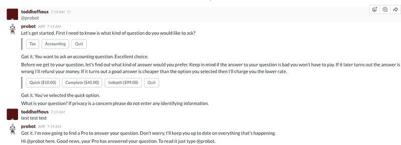
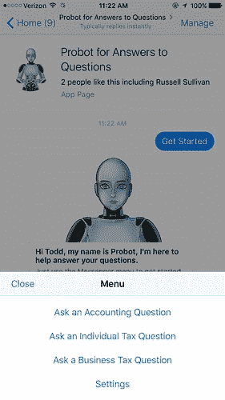

# Probot 的体系结构-我的 Slack 和 Messenger Bot 用于回答问题

> 原文： [http://highscalability.com/blog/2017/3/15/architecture-of-probot-my-slack-and-messenger-bot-for-answer.html](http://highscalability.com/blog/2017/3/15/architecture-of-probot-my-slack-and-messenger-bot-for-answer.html)

我编写了一个东西。 称为 [Probot](https://probot.us/) 。 Probot 是一种快速简便的方法，可为您的会计和税务问题提供高质量的答案。 Probot 将找到一位真正的现场专家来回答您的问题并处理所有细节。 您可以通过 Facebook Messenger，Slack 或 Web 回答问题。 答案最低为 10 美元。 那就是球场。

在这种新的机器人时代似乎很自然，不是吗？ 我还是这么想。 没有那么多（到目前为止），但是稍后会更多。

我认为 Probot 足够有趣，因为它是一个程序员（我）如何利用当今的基础架构可以完成很多工作的一个很好的例子。

实际上，所有这些新颖的云/无服务器/服务内容都可以正常工作。 我能够以相对可扩展，可用和负担得起的方式对跨越 Messenger，Slack 和 Web 的系统进行编程，同时只需最少的开发。

过去，担心 VPS 限制，开车前往 Colo 网站检查有问题的服务器，甚至担心容器/虚拟机集群自动扩展的日子已经一去不复返了。 至少对于许多用例而言。

多年的编程经验和撰写此博客无法避免犯错误。 在此过程中，我犯了很多愚蠢的愚蠢错误，但我对最终的想法感到满意。

这是 Probot 的工作方式。...

## 平台

*   无服务器：AWS Lambda

*   Web 主机：S3 上的静态站点，单页应用程序

*   语言：Javascript /节点

*   API：API 网关

*   DNS：Route53

*   CDN：CloudFront

*   用户登录名： [Cognito](https://github.com/aws/amazon-cognito-identity-js)

*   SSL 证书：让我们加密

*   服务器：EC2，t2.small，Ubuntu

*   信息库：GitHub

*   源代码控制：Git

*   付款：贝宝

*   Slackbot： [Botkit](https://github.com/howdyai/botkit)

*   队列：SQS

*   备份：AWS Data Pipeline，每周将生产数据保存到 S3

*   数据库：DynamoDB

*   节点进程管理器： [PM2](http://pm2.keymetrics.io/)

*   SSL 终止：Nginx

*   Web 框架：jQuery，Bootstrap

*   开发平台：MacBook Air

*   本地测试 Web 服务器： [http 服务器](https://www.npmjs.com/package/http-server)

*   测试隧道： [Ngrok](https://ngrok.com/)

*   SQS 轮询： [平方英尺消费者](https://www.npmjs.com/package/sqs-consumer)

*   日志记录：CloudWatch

## 起源故事

我的妻子 [琳达·科尔曼](http://www.possibility.com/Lgc/AcctRes.html) 是一名注册代理，这意味着她是一位了不起的税务会计师，并且在会计专家中都很有经验。 她有一个网站 [BizTaxTalk](http://biztaxtalk.com/) ，在这里她为人们的税收问题提供了很好的答案：免费。 她有很多问题。 有真正问题的人需要帮助，很难找到可以回答这类问题的人。

您可能会想像它变得势不可挡。 她最终不得不放弃 BizTaxTalk，因为它占用了她太多的时间。

我想为什么不通过它获利？ 琳达可以回答人们的问题并获得报酬。 双赢。 我知道这种类型的质量检查网站不是新手，但机器人程序是解决该问题的新方式，应该是处理此类信息交换的一种很好的方式。 使用文本可以非常方便地异步处理问答流程。

因此，Probot 建立了一个双面市场。 有问题的用户（例如约会服务）与能够回答其问题的主题专家（称为 Pro）相匹配。 Probot 处理消息的匹配，计费和协调。

尽管我显然会从税务和会计问题入手，但最终可以吸引更多的主题专家，并且话题数量也有所增加。 这就是我编写代码的方式。 它可以轻松扩展以处理新主题和问题树。

这就是我要建立的。

## 架构

*继续阅读* 。 这是一遍又一遍的 HS 建议。 那就是我所做的。 我有在 Node 上使用最出色的 [Botkit](https://github.com/howdyai/botkit) 制作 Slackbots 的经验，因此我就从这里开始。

我也有使用 AWS Lambda 来开发 Alexa 技能的经验，并且不想管理任何东西-玩系统管理员多年就足够了-所以我选择了 AWS。 如果 Google Cloud Functions 是 GA，那么我可能会选择使用 Google Cloud。

以下是我们将介绍的所有主题：

*   ProbotService Lambda 函数

*   Slackbot

*   Messengerbot

*   网站

*   PayPal 集成

*   测试

*   采纳

*   获得的经验教训

## ProbotService Lambda 函数

这是实现 Probot Service 后端的 AWS Lambda 函数。 大多。 这也是我许多愚蠢错误的根源。 让我解释。

我为 Slack 编写的第一个 Probot 机器人用于 Slack，并且取得了一些进步，但是 Slackbot 在 EC2 实例上的 Ubuntu 进程中运行。

我犯的一个大错误是不首先使用 API​​。 我的大部分职业都是建立另一种消息协议。 是我做的吗？ 当然不是。

我对所有机器人逻辑进行了编程，因此可以直接在 Slackbot 流程中执行。 这是可能的，因为 AWS 具有用于访问 DynamoDB，SQS，Lambda 和其他 AWS 服务的漂亮 Node API。 因此，所有 AWS 访问都直接用 javascript 编码。 效果很好。 没问题

当我需要制作 Web 客户端时出现了问题。 嗯，在相同的代码也几乎可以在 Web 客户端中正常工作的意义上，这并不是问题。 真酷。 因此，我浪费了很多时间来建立 Slack 和 Web 客户端可以共享的通用库。 但是我对我的数据库访问代码可以在 Web 上看到的想法感到非常不舒服。 对于 Intranet 服务，我不会担心，但按我的喜好显示数据结构的攻击面太大了。

我犯的另一个大错误，也与不首先创建 API 有关，是因为对 DynamoDB 在数据库更改时将新值和旧值传递给 Lambda 函数的能力深感兴趣。 我所做的是像状态机一样触发逻辑。 例如，如果旧记录说状态为 PENDING，而新状态为 ASSIGNED，则触发 PENDING 到 ASSIGNED 的转换。 它有效，我认为它真的很聪明。 问题在于面对许多无法移动状态但仍触发 Lambda 函数的操作，它过于脆弱。

解决这两个问题的方法是构建一个 API，我使用 Lambda 做到了。 我选择不使用 API​​ Gateway，因为直接从 Node 调用 Lambda 函数非常容易。 API 网关增加了延迟，复杂性和成本。 也很难使用。 从 HTTP 请求转换参数并将其映射到 Lambda 调用对于任何复杂的事情来说都是非常接近魔术的过程。 回复相同（反方向）。 如果将来需要使用公共 API，则可以重新考虑此决定，但是直接使用 Lambda 是非常简单的方法。 必须更改所有 Slack 和 Web 代码才能使用新的 API。 真痛苦

### 如何构建无服务器 API？

下一个决定是如何构建 API？ 每个 API 调用都映射到一个单独的函数吗？ 还是将功能归为一个入口？ 还是可能有多个入口点？

我选择了一个入口点。 之所以采用这种方法，是因为我不想使用框架来管理 Lambda。 我想知道所有东西如何连接在一起，框架包含很多魔术。 因此，我创建了一个 zip 文件，并使用 AWS 控制台将其上传到 Production 或 Test。 将来，我将使其自动化，但现在可以正常使用。

使用单个入口点时的一个问题是如何复用函数调用？ 我选择模仿 [JSON-RPC](http://www.jsonrpc.org/specification) ，这些在过去我已成功用于服务器应用程序。

请求包装在 JSON-RPC 负载中。 使用“ method”属性指定要调用的方法，并使用“ params”属性传递任何参数。 ProbotService index.js 文件解压缩 JSON-RPC 请求并调用正确的方法。 看起来像：

> 如果（request.method ===“ giveAnswerToUser”）{
> 
> var op = new QuestionImpl（appcfg）;
> 
> op.giveAnswerToUser（request.params，function（error，data）{
> 
> 返回 sendResponse（错误，数据，请求，回调）；
> 
> }）
> 
> }

我以标准的 RPC 方式创建了一个名为 ProbotService 的存根对象，该对象使从客户端代码调用 Lambda 函数变得更加容易。 例如： *service.getQuestion（id，callback）*格式化正确的 JSON-RPC 结构，调用正确的 Lambda 函数，并在返回回复时调用回调。

### 共享代码

我选择不在 Facebook Messenger 机器人代码中调用 ProbotService Lambda。 而是，服务库代码与 Messenger 代码打包在一起并直接调用。 这是一种代码共享方法。 在 ProbotService 和 Facebook Messenger 之间共享相同的基础代码。

原因是 Facebook Messenger Webhook 调用通过 API 网关调用，该 API 网关调用 Lambda 函数。 使用 ProbotService 还会调用 Lambda 函数。 因此，将在另一个 Lambda 函数中调用 Lambda 函数。 这可以正常工作，但是最坏的情况下的延迟比我希望用户体验到的要高，因此我选择通过共享代码来删除跃点。 我仍然不确定这是否是最好的决定，但是它确实有效，并且 Messenger 机器人的响应时间让人感觉很快。

由于 Slackbot 在自己的进程中运行，因此没有多余的跃点，因此使用 ProbotService 是正确的选择。 Web 客户端代码中也使用了 ProbotService，因此不会泄漏任何内部详细信息。

### ProbotService API

以下是 Probot API 中的一些功能。 我不会使用 Swagger 之类的文档。

*   updateFromPaypalWebhook

*   getQuestion

*   GiveAnswerToUser

*   GiveAnswerToPro

*   askQuestionOfUser

*   cancelQuestion

*   acceptProAnswer

## Slackbot

 

### 机器人样式

对机器人进行编程时，您必须做出的决定之一是：您要使用对话式 AI 风格机器人还是结构化命令驱动风格机器人。

我采用了结构化的命令驱动方法。 用户选择一个问题主题，然后漫游器会引导他们通过问题树收集 Pro 回答此类问题所需的数据。 例如，对于纳税申报表，您需要知道它是哪一年，是个人还是公司，是否是公司的实体类型（合伙企业，C-Corp 等），等等。

AI 风格很性感，但如果那不是您的事，那么做起来真的很难。 因此，我想出了一种与用户进行对话的方式，可以针对每个问题进行自定义。 实际上，我提出了几种不同的对话描述符解决方案，但我对其中任何一个都不满意。 这是 Slack 的样子：

> probot.machine.add（“ ask-return-type”，{
> 
> 操作：probot.machine.askFromOptions，
> 
> 选项：[“个人”，“业务”]，
> 
> 显示：[“个人”，“业务”]，
> 
> 问题：“在回答税收问题时，帮助您的专家了解报税种类会很有帮助。”，
> 
> sayOnAccept：“知道了。您选择了 _ {response} _ 选项。”，
> 
> 答案：功能（机器，cmd，答案，下一个）{
> 
> console.log（“ ask-return-type：answer：” + answer）;
> 
> probot.dto.setReturnType（answer）;
> 
> if（answer ===“ individual”）
> 
> 的 cmd.next =“询问税年”；
> 
> 其他
> 
> cmd.next =“询问实体类型”;
> 
> next（null）;
> 
> }，
> 
>    })

我对 Messenger 采取了完全不同的方向。 我也很讨厌这种方式。

### 松弛主机

使用 Slack 时，webhooks 可用于实现 Slack 命令，但是对话风格要求代码在流程上下文中运行。 因此，我建立了一个没有任何冗余的小型 EC2 实例。 由于我不希望用户在 Slack 上不断与 Probot 互动，因此我认为停工时间不会造成任何伤害。 所有状态都将在 DynamoDB 中，因此不会丢失任何内容。 弹性 IP 用于访问主机。

*保持简单，不要使事情复杂化* 。 关于 HS 的另一个很长的课程。 如果有人最终使用您的系统，则可以稍后再做所有花哨的工作。

[PM2](http://pm2.keymetrics.io/) 是出色的 Node 进程管理器，用于在 Slack 进程死后重新启动它。 PM2 还管理日志并执行其他一些精美的操作。 Route53 会 ping 通该过程，并在出现任何问题时向我发送电子邮件。 够好了。

Botkit 完成了许多繁重的工作。 它处理程序与 Slack 之间的所有协议工作，同时为身份验证，进行对话之类的事情提供了许多方便的抽象方法。

### 互动消息

在我完全完成 Slackbot 实现之后，Slack 引入了用户使用按钮而不是输入文本来进行选择的功能。 由于我还没有发布任何东西，所以是时候进行更改了。 这些按钮确实使用户更容易。 问题是按钮需要您的进程实现 HTTPS Webhook，以便 Slack 可以通过按下哪个按钮的信息回调到您的进程中。 这是开发流程的重大变化。 松弛的开发是很好的，以前也包含在内。 现在，您的机器人程序必须可以通过 URL 从外部进行访问。

在 EC2 中的生产机器上还不错。 我使用 Nginx 终止 SSL，并将请求传递给 Slackbot 进程。 这需要使用我使用“加密”的 SSL 证书。 由于必须定期更新，这是维护上的麻烦，但它们是免费的，因此请选择毒药。

让 Slack 通过 Comcast 路由器访问在笔记本电脑上运行的进程并不容易。 我在各种解决方案上浪费了很多时间。 很多时间。 我最终屈服了，并向 Ngrok 支付了他们的隧道服务。 像魅力一样工作。 花钱。 Slack 应该考虑能够完全在无服务器上工作。 那将是一个更清洁的解决方案。

### 身份和验证

在 Probot 中，没有尝试创建 Slack，Messenger 和网络上常见的用户。 每个都使用其环境固有的身份机制。 对于 Slack，这意味着使用 Slack 分配的团队 ID 和用户 ID。 Probot 询问用户的姓名和电子邮件地址，但不打扰身份和身份验证。 Slack 处理所有这些。

### 数据库

Slack 提供了自己的数据库抽象，用于存储团队，用户和渠道。 当 Probot 使用 DynamoDB 时，我创建了一个简单的 [适配器](https://github.com/ToddHoff/botkit-storage-dynamodb) ，该适配器允许 Slack 将其数据存储在 DynamoDB 中。

通常的做法是在 Slack 的数据结构中插入自己的属性。 因此，用户数据存储在 Slack 的用户对象中。

### 从 Pro 向用户发送消息

与用户对话时，使用 Botkit 发送消息就像 *bot.say（“某些字符串”）* 一样容易。 在以后的某个时间以异步方式向用户发送消息并非易事。 例如，当专业人士为用户提供答案或想要提出问题时，必须向用户提供消息。

我可以弄清楚如何使异步消息传递起作用的唯一方法：

*   当团队连接到 Probot 时，将 Botkit 机器人 对象存储在内存中。 需要机器人对象才能向用户发送消息。

*   每个用户都与一个团队相关联，因此当出现消息时，可以找到适当的机器人对象。

*   来自 Pro 的所有消息都排队到 AWS SQS。

*   Slackbot 进程使用一个名为 sqs-consumer 的漂亮软件包来轮询 SQS 以获取消息。

*   使用 bot 对象将消息发送给用户。

*   用户调用@probot 进行对话以处理消息。 该消息可能是答案，问题或状态更新。 用户可以对答案进行评分并发表评论。 他们还可以拒绝答案，这意味着用户无需付费。 我不希望别人觉得自己被人扯了。 这是 Pro 承担的风险。 尽管我不这样做，但匹配算法可以在进行匹配时利用评分数据。

Sqs 消费者是为什么 Node 对开发人员如此高效的一个示例。 是的，javascript 很烂。 是的，回调编程有点糟。 但是从字面上来看，我需要花五分钟的时间思考*，我需要轮询 SQS* 来找到一个好的 npm 可安装软件包并拥有有效的代码。 Node 一直在发生这种情况。

## Messengerbot

 

Messenger 是与 Slack 完全不同的野兽。 尽管 Botkit 支持 Messenger，但我还是决定直接将代码编码到 [Messenger API](https://developers.facebook.com/docs/messenger-platform/) ，因为它比 Slack 简单得多。 那是因为作为团队协作工具，Slack 具有很多功能。 Slack 具有用于与团队，渠道，用户，组，权限，功能等配合使用的各种 API。

使用 Facebook Messenger 时，将通过 Webhook 接收消息，并使用 HTTP 调用发送格式化的消息。 那几乎就是您所能做的。 因此，Messenger 机器人可以完全在 Lambda 函数上运行。 如果您不关心团队的所有方面，那么 Messenger 可能是一个更好的起点。

回想一下，这是 和您所知道的 咬住我的地方。 Probot 不是团队工具。 它与用户进行一对一的交互，因此所有开销都没有任何好处，并且需要很长时间才能解决。 另一方面，Slack 的员工非常乐于与他们合作。 如果您有问题，那么有技术印章的真实人将为您提供一个很好的答案。 你可以想象？

实际上，我一直在考虑取消对 Slack 的支持，因为没有人在使用它，而且 EC2 实例每月都要花我很多钱。 无服务器可为此类工作量赢得大量时间。 使用 Lambda，我只在人们实际使用 Probot 时付款。

### 简化 Messenger

一件事立即变得很清楚，那就是必须简化 Probot 才能在 Messenger 上正常工作。 使用 Slack 时，复杂的用户交互变得自然。 在 Messenger 上，复杂的问题树根本不起作用。

我所做的一个简化是减少用户可以从 Pro 请求的答案类型。 在 Slack 上，用户可以要求以不同的价格快速，完整或深入地回答问题。 添加这一额外的交互层会使整个过程陷入困境，因此，使用 Messenger 时，Pro 可以提供的唯一可能的答案类型是 Quick 类型。

无法将简短的文本字符串发送到 Messenger 进一步增强了对简短和简单的需求。 松弛搭配文字很棒。 您可以吐出文本页面没问题。 有了 Messenger，您可以发送的最大尺寸。 长字符串必须分成大块，而不是美观。

另一个简化是 Messenger 上，用户一次只能回答一个未解决的问题。 在网络和 Slack 上，用户可以一次打开多个问题。 回想起来，这可能也是我应该构建 Slack 的方式。 通过聊天界面管理多个悬而未决的问题很复杂。

这是关于 HS 的又一个很长的课程： 保持简单愚蠢 。 说起来容易做起来难。

### Facebook Messenger Webhook

在 Messenger 机器人配置中，指定了一个 Webhook，Facebook 会使用用户相关事件进行调用。 Webhook 使用绑定到 Lambda 函数的 API 网关实现。 Lambda 函数是使用共享代码方法实现的。 它包含了所需的所有源代码，而不是调用其他服务。

Lambda index.js 文件中的启动代码负责解析来自 Facebook 的消息并正确分发。 在处理每个消息之前， startSession 与发送者 ID 一起调用，该 ID 被用作用户 ID。 startSession 获取用户记录（如果存在），如果不存在，则请求该用户的配置文件并创建用户记录。 如果用户记录中已有问题 ID，则会从数据库中检索该问题，并创建该问题的状态机对象。 传入消息是状态机上的一个事件，它驱动消息的处理方式。

使用 startSession 来处理用户消息所需的所有数据均已就绪，因此任何较低级别的代码都不必担心。 同样，在处理完一条消息后，将检查脏标志，如果对象已更改，则会在数据库中自动对其进行更新。 我发现这种风格使使用 Lambda 函数更加简洁。 较低级别的代码永远不必担心状态管理。

这是 Slack 比 Facebook 更具优势的领域。 Lambda 函数无法存储状态，因此必须激活每个状态并随每个请求将其钝化。 使用 Slack，状态可以存储在 Slackbot 进程中，尽管如果我要再做一次，则可能不会将状态保持在 Slack 中。 转到数据库并编辑记录并在下次请求时提取更改非常方便。 为了使这些更改在 Slackbot 中可见，必须重新启动该过程。

Messenger 具有许多不同类型的消息：消息，回发，身份验证，传递确认，消息读取，帐户链接等。 消息类型有几种子类型：快速答复，文本，回声，回执，已读回执，键入，键入，等等。

通常，我唯一要注意的消息是与用户的交互。 所有命令源均映射为通用请求格式，并馈入 Question 状态机。 例如，当用户点击“回发”按钮，“开始”按钮，“持久”菜单或“结构化消息”时，发生回发事件。 我认为来自用户的任何纯文本输入都是为了响应我之前提出的问题。 快速回复 只是用户可点击按钮的另一种类型。

### Facebook 问题状态机

所有问题都存储在 DynamoDB 中。 每个问题都有一个属性，用于指定问题所在的当前状态。将消息标准化为通用请求格式后，将其应用于“问题”状态机，该状态机看起来像：

> var QuestionDto = require("./QuestionDto");function FacebookQuestionSm(appcfg, startState) {  console.log("FacebookQuestionSm:startState:" + startState);  this.startState = startState;  var self = this;  this.any = {    help: {      action: FacebookQuestionSm.sendHelp,    },    getstarted: {      action: FacebookQuestionSm.sendGetStarted,    },    settings: {      action: FacebookQuestionSm.sendSettings,    },    status: {      action: FacebookQuestionSm.sendStatus,    },  ...  this.states = {    start : {      on : {        accounting: {          forward: "ask_accounting_question"        },        ask_accounting_question: {          action: FacebookQuestionSm.createQuestion,          next: "ask_question",          data: { type: "accounting", msg: "Great choice, I see you want to ask an accounting question." }        },        ask_individual_tax_question: {          action: FacebookQuestionSm.createQuestion,          next: "ask_tax_year",          data: { type: "tax", returnType: "individual",                   msg: "Great choice, I see you want to ask a tax question for an individual."           }        },        ask_business_tax_question: {          action: FacebookQuestionSm.createQuestion,          next: "ask_entity_type",          data: { type: "tax", returnType: "business",             msg: "Great choice, I see you want to ask a business related tax question."           }        }      }    },    ask_tax_year : {      action: FacebookQuestionSm.sendTaxYearQuestion,      on : {        text: {          verify: FacebookQuestionSm.verifyTaxYear,          action: FacebookQuestionSm.saveTaxYear,          next: "ask_question"        }      }    },
> 
>     ...
> 
> }
> 
> this.on = function（appcfg，userid，request，next）{
> 
> console.log（“ on：userid：” + userid +``request：“ + JSON.stringify（request））;
> 
> }

上的 *方法接受请求并将其应用于状态定义。 这可以正常工作，但是处理用户可以与机器人进行交互的所有方式都会使代码看起来有些骇人。*

### Identity and Authentication

与 Slack 一样，Facebook 提供了专门用于 Messenger 的用户 ID，而我只是使用该 ID。 它不是真实的 Facebook 用户 ID，因此您不能使用 graph API 来获取大量用户信息。 该 ID 与问题一起存储，因此可以将答复直接发送给用户。

### Database

Slack 的 Facebook 数据库 API 等效，因此用户数据存储在 DynamoDB 中 Facebook 特定的用户表中。

## 网站

 

[Probot.us](https://probot.us/) 是 S3 上托管的单页应用程序。 作为单页应用程序，所有操作均使用 Slack 使用的相同 ProbotService API 完成。 使用 S3 的优点是我无需管理任何事情。 它是一个与其他网站非常相似的网站，因此我不会在此进行过多介绍，但有一些主题值得注意。

### 电子邮件崩溃

您是否曾经做过一些您最终不会做的事情，但还是成功了？ 这是另一个浪费时间的大错误。 毫无疑问，我不太擅长制作网站。 我希望这可以解释为什么我真正尝试完全避免制造一个。

我所做的是通过电子邮件使所有 Pro 交互工作。 问题将通过电子邮件发送给专业人士。 专业人士会通过电子邮件答复并回答问题。 电子邮件中的关键字使它可以解析和提取数据。 用户没有注意到差异，因为他们仍然会使用 Slack 或 Messenger。

这是流程：Probot 向 Pro 发送了电子邮件。 例如，将问题分配给专业人士时，他们将收到一封包含该问题，有关用户的信息以及一些簿记属性的电子邮件，以将电子邮件映射回该问题。 专业人士会回覆他们的回应，并确保将文字插入正确的位置，以便可以正确解析。 AWS 收到了 Pro 的回复并将其保存到 S3 中。 这导致了 Lambda 函数被调用。 该功能将解析电子邮件，提取所有数据，并相应地更新用户。

尽管配置很麻烦，但实际上确实有效，并且编写代码很有趣。 只有我的测试专家讨厌它。 只是讨厌它。 当然，他们做到了，这对他们来说很糟糕。 因此，我最终制作了 Pro 仪表板，以管理我一直知道自己必须解决的所有 Pro 问题。 我还添加了一个收件箱，以便用户可以在网络上提问和管理问题。 同一网站还为 Slack 用户充当着陆页，以便他们可以将 bot 安装到他们的团队中。

### [HTG0 BC]

尽管我已经在 Golang 中使用了完整的用户注册系统，但我希望将所有内容保留在 Node 中。 我决定重试一下，而不是重新发明轮子。 我不想对用户密码的安全性负责，Cognito 可以处理所有这些。 使用起来很棘手，这里的有一些奇怪的问题要弄清楚。 示例代码和文档可能会更好。 但是我最终得到了所有典型的流程-注册，忘记密码，更改密码，重新发送验证码，输入验证码等-都可以正常工作。 这并不容易，但是似乎可以可靠地工作。

### 节点和浏览器之间共享代码

这是我犯的另一个错误：我不打算在 Node 和浏览器之间共享代码。 到我意识到可以共享很多代码的时候，采用另一种模块哲学已经太费力了。 我确实共享代码，但是在包含导致在两种情况下都不起作用的依赖项的代码时，我必须非常小心。

## PayPal 集成

我选择 PayPal 是因为我发现它们的 API 是可以理解的，其仪表板也可以使用，并且其文档可以使用。 支持速度很慢，但通常会有所帮助。

当用户接受专业人士对其问题的回答时，付款状态机将启动。在 ProbotService 中，PayPal API 用于创建发票，该发票由 PayPal 发送到用户的电子邮件地址。 通过 PayPal，您可以配置一个 Webhook 来使用发票相关事件。 Webhook 使用绑定到 Lambda 函数的 API 网关。

当 Lambda 函数接收发票事件时，它将在事情发生时通知用户和 Pro。

*   松弛：通过前面描述的 SQS 机制通知用户。 会向 Pro 发送电子邮件，告知他们应该访问仪表板以获取详细信息。 绝不会通过电子邮件发送任何敏感信息。

*   Messenger：发短信给用户。 请注意，要在上次联系后 24 小时向用户发送消息，您必须对机器人具有特殊权限。 这并不总是容易获得的。 因此，如果您的机器人需要提前进行此类功能计划。

*   Web：向用户发送电子邮件，并要求用户登录 Probot 以获得其仪表板上的更多信息。

这花了一些时间才能开始工作。 如果未调用与 Webhook 关联的 Lambda 函数，则很难理解问题所在。 绝对打开 A​​PI 网关日志记录。 您将需要它。

PayPal Lambda 函数使用与前面所述相同的代码共享方法。 无需进行远程 ProbotService 调用，而是直接调用代码。

## 测试

这里没什么好想的。

对于 API 网关，Lambda 和 DynamoDB，有所有版本的测试和生产版本。 根据配置在运行时选择使用哪个。

该网站有测试和生产版本。 为了测试它们，我只使用所有功能。 使用 *aws s3* 命令行将文件从开发环境复制到 S3。 对于本地开发，将 http-server 用作 Web 服务器，并且可以通过 localhost 测试所有功能。

PayPal 具有测试和生产配置选项。 每个都分别指向测试和生产网络挂钩。 PayPal 具有在调用 Webhooks 时记录的日志，这在调试时很有用。 不幸的是，事件不是实时发送的，因此您必须等待事件被发送并显示日志。

对于 Slack，有一个单独的机器人，用于测试和生产。 每个都分别指向测试和生产网络挂钩。 Messenger 也是一样。 除了将测试版本和生产版本视为完全不同的漫游器之外，我没有其他更清洁的方法。

对于本地开发，Slackbot 在开发计算机上运行。 Ngrok 用作隧道，因此 Slack 可以向该进程发送交互式消息。 使用网站的测试版本将测试机器人安装到团队中。 它具有正确的应用程序令牌，可以识别机器人的测试版本。 安装测试机器人后，您可以通过 Slack 与该机器人对话。

对于本地开发测试，通过共享代码使 Lambda 代码变得更加容易。 唯一可以调用的外部服务是其他人的服务，而不是您自己的服务。 因此，要进行测试，根本不需要将代码上传到 Lambda。 Lambda 函数中使用的相同代码可从可从命令行执行的脚本中调用。 为您 API 中的每个函数创建一个相应的脚本，并且可以在本地对其进行完全调试。

Messengerbot 的本地开发测试比较棘手，因为将消息发送到 bot 时，消息会显示在 Messenger 中。 当您点击按钮时，回复将返回到您的测试网络挂钩。 据我所知，尚无干净的方法可以以可单元测试的方式进行此操作。 我所做的是将 Bot 的测试版本安装到 Messenger 中并记录了用户 ID。 在为每个方案制作测试脚本时，在运行时选择要使用的用户 ID，测试版本或生产版本。 如果方案涉及要求用户回答问题，则将从脚本中发送问题。 然后，您转到手机上，然后使用测试机器人进行回复。 答复将转到您的测试网络挂钩，以便代码可以正常运行。 我对这种方法不是很满意，但是这种方法确实有效，并且比通过 Messenger 进行的所有测试都更快。

总有一天应该从 GitHub 安装所有内容，但今天不是那天。

## 采纳

吸收不好。 我希望随着税收季节临近活动的到来。 问题的一部分在于，作为一名程序员，我几乎迷上了营销。 我正在尝试 Messenger Bot 广告，但是这些广告无效。

使用尝试使漫游器不转化的渠道隐喻用户，他们在实际转化并提出问题之前已经保释。 可能存在信任问题。 他们不知道他们在问谁或将得到什么样的答案。 我尝试在网站和漫游器页面上解决这些问题。 例如，如果您不喜欢答案，则无需付款，因此无风险。

一种可能性是人们并没有真正使用 Messenger 机器人，并且对于这种应用程序而言，这是一次失败的实验。

另一个可能性是我的机器人不是很好。 完全有可能的事情。

如果您有任何想法或疑问，请告诉我。

## 获得的经验教训

*   **不要做您所知道的**。 在盲目做您知道的事情之前，先环顾四周，看看是否有更好的选择。

*   **API 优先**。 为您的服务提出一个抽象并将其实现在一个地方。 当您必须在不同的平台上实现另一个客户端时，您将感激不尽。

*   **DTO 首先**。 我犯了通过代码库传播数据库访问代码的错误。 只需创建一个数据传输对象并将代码从一开始就集中在一个地方即可。 然后，可以轻松打包和重用它。

*   **一次**。 要做的聪明的事情是必须使一个简单的机器人来测试这个概念。 我当时知道这一点，但是我真的很想看看在所有三个平台上开发一个机器人的感觉。 那个决定的人是个白痴。

*   **吻**。 这么容易说，很难做到。

*   **提前计划共享节点和浏览器模块**。 一旦已经编写了很多代码，就很难进行改造。

*   **代码共享**。 在 Lambda 函数之间共享很好的模块化库代码在实践中效果很好。 它使从命令行进行测试变得容易。

*   **无服务器作品**。 由于种种原因，每个人都在涌动。 它可以让一个人完成很多工作。 您有发展机会，但管理起来却少得多。 对于不可预测的工作负载，它便宜得多且可扩展性更高。 我不能说工具很烂，因为我选择不使用任何工具，但是我们仍然有一种方法可以弄清所有这些在实践中是如何工作的。

*   **事件> API** 。 使用 webhooks 使用 Serverless 将系统连接在一起非常强大。 相比之下，站起一个盒子并运行一个过程来使用 API​​似乎很原始。

像大多数课程一样，回想起来，大多数这些令人沮丧的头脑震撼显而易见，但是我想这就是为什么它们是课程。

看起来很酷

哇听起来真酷 您是独自建造的吗？ 花了多少时间？

是的，只有我。 这花了一个令人尴尬的时间:-)

@ToddHoff 几乎所有编程都可以，尤其是在您必须学习新知识的情况下，这几乎总是这样，因为有各种各样的工具可以完成工作。

您的帖子非常有趣。 我正在尝试从中学习。 但是我不明白一件事。

您提到了为 lambda 创建单个入口点，然后将请求路由到单独的函数。 但是，如果没有 API 网关，请求如何首先到达 lambda？

嗨，杰克，

可以通过 API 直接调用 Lambda 函数。 他们不需要通过 HTTP。 我大致是这样做的：

包括适用于您的环境的 AWS API，对于 Web 或 in 节点而言，有所不同。

appcfg.AWS = require（“ aws-sdk”）;
appcfg.DB =新的 appcfg.AWS.DynamoDB（）;
appcfg.DBCLIENT = new appcfg.AWS.DynamoDB.DocumentClient（）;
appcfg.LAMBDA = new appcfg.AWS.Lambda（）;
appcfg.SES =新的 appcfg.AWS.SES（）;
appcfg.SQS = new appcfg.AWS.SQS（）;

函数 ProbotService（appcfg）{
this.id = 0;
var self = this;

this.invokeLambda = function（method，params，next）{

var payload = {
method：method，
params：params，
id：self.id ++
}

var params = {
FunctionName：appcfg.Amazon.ProbotService，
Payload：JSON.stringify（payload）
}

appcfg.LAMBDA.invoke（params，function（error，response）{
if（error）return next（error）;

var payload = JSON.parse（response.Payload）;
如果（payload.error）返回 next（payload.error）；
如果（payload.errorMessage）返回 next（new Error（payload.errorMessage））;

返回 next（空，payload.result）；

}）//调用

} // invokeLambda

嗨，托德，

感谢您的广泛回应！

实际上，我知道如何调用 lambda。 我从您调用它的地方很好奇。 看来您可能是从客户端调用它的？

PS。 我刚刚开始学习 nodejs。 因此，无论我说什么，都可能变得毫无意义。

是的，无论是网站上的客户端，还是 slack 上的 nodejs 内，还是 lambda 本身的 nodejs 内，都是客户端。 尽管几天前我关闭了 slackbot。 太昂贵了，无法继续运行。

只需为环境添加正确的库并正确配置即可。

在网上：

<脚本 src =“ js / aws-cognito-sdk.js” > < / script >
<脚本 src =“ js / amazon-cognito-identity.min.js” > < / script >
<脚本 src =“ https://sdk.amazonaws.com/js/aws-sdk-2.3.5.min.js” > < / script >

在 slack 和 lambda 上，它们将 sdk 安装到 node_modules 中，并且由于用户看不到环境，因此可以从文件中加载配置。
var AWS = require（'aws-sdk'）;
AWS.config.loadFromPath（'cfg.json'）;
appcfg.AWS = AWS;

我保持对 appcfg 中所有服务的访问权并将其传递。 这样，您可以在启动时以特定于环境的方式配置所有内容。

现在，您可以在所有环境中使用相同的 lambda 调用代码。

this.giveAnswerToPro = function（answer，next）{
return self.invokeLambda（“ giveAnswerToPro”，答案，下一步）;
} // GiveAnswerToPro

这是我的模块问题出现的地方。您必须小心在每个环境中包含的内容。 在网络资料中包含一个在 nodejs 中不可用的模块，您已将其破坏。

这很酷。 您是否考虑过在营销中使用会计师的图片和/或个人资料？ 甚至有照片。 主页上显示“真实的会计师”，因此看到它可能会让人放心。

Hi Todd,

感谢您的回复！

我知道可能要问很多。 但是，如果您不介意，会介意开放源代码并与我们共享吗？
对像我这样的人进入 nodejs 和 aws 领域确实很有帮助。

谢谢。

我得考虑杰克。 我不确定如何将我的东西充分分离出来。

有趣的文章。