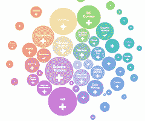

# 棱镜更新：基于文档和用户的机器学习

> 原文： [http://highscalability.com/blog/2012/8/1/prismatic-update-machine-learning-on-documents-and-users.html](http://highscalability.com/blog/2012/8/1/prismatic-update-machine-learning-on-documents-and-users.html)

在 [Prismatic Architecture-使用社交网络上的机器学习确定您应该在网络上阅读的内容](http://highscalability.com/blog/2012/7/30/prismatic-architecture-using-machine-learning-on-social-netw.html)的同时，Jason Wolfe 甚至面对漫长的夜晚将 iPhone 应用程序投入使用而感到疲倦的感觉， 英勇地同意谈论 Primatic 的机器学习方法。

文档和用户是 Prismatic 应用 ML（机器学习）的两个领域：

### 文件 ML

*   给定一个 HTML 文档：
    *   了解如何提取页面的主要文本（而不是侧边栏，页脚，注释等），标题，作者，最佳图像等
    *   确定相关功能（例如，文章的主题，主题等）
*   其中大多数任务的设置非常典型。 使用其他机器上的大批作业对模型进行训练，这些机器从 s3 读取数据，将学习到的参数文件保存到 s3，然后在摄取管道中从 s3 读取（并定期刷新）模型。
*   流出系统的所有数据都可以反馈到该管道中，这有助于了解更多有趣的内容，并随着时间的推移从错误中学习。
*   从软件工程的角度来看，Prismatic 编写的最有趣的框架之一是“ flop”库，该库实现了最先进的 ML 训练和推理代码，看起来与精美的普通 Clojure 代码非常相似，但是可以编译（使用 宏的魔力）到低级数组操作循环，这些循环与 Java 一样接近金属而无需借助 JNI。
*   与相应的 Java 相比，该代码可以紧凑和易于阅读，并且执行速度基本相同。
*   创建[快速运行的故事聚类组件](http://blog.getprismatic.com/blog/2012/4/17/clustering-related-stories.html)付出了很多努力。

### 用户 ML

*   猜测用户对社交网络数据感兴趣的内容，并使用应用内的显式信号（+ /删除）完善这些猜测。
*   使用显式信号的问题很有趣，因为用户输入应该很快反映在其提要中。 如果用户连续从给定的发布者中删除了 5 篇文章，请立即停止向他们展示该发布者的文章，而不是明天。 这意味着没有时间在所有用户上运行另一个批处理作业。解决方案是在线学习：立即根据用户提供给我们的观察结果更新用户模型。
*   用户交互事件的原始流已保存。 这样可以在以后发生机器故障或类似情况时通过原始数据上的松散写回缓存丢失任何数据，从而在以后的原始事件中重新运行用户感兴趣的 ML。 在线学习中的漂移可以得到纠正，并且可以计算出更准确的模型。