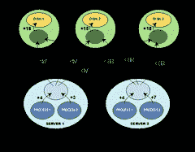

# 搜索技术剖析：blekko 的 NoSQL 数据库

> 原文： [http://highscalability.com/blog/2012/4/25/the-anatomy-of-search-technology-blekkos-nosql-database.html](http://highscalability.com/blog/2012/4/25/the-anatomy-of-search-technology-blekkos-nosql-database.html)

*这是 blekko 的首席技术官 Greg Lindahl 的来宾帖子（[第 2 部分](http://highscalability.com/blog/2012/5/28/the-anatomy-of-search-technology-crawling-using-combinators.html)，[第 3 部分](http://highscalability.com/blog/2012/7/9/data-replication-in-nosql-databases.html)），该网站是垃圾邮件免费搜索引擎，3 月的独立访问者超过 350 万。 Greg Lindahl 是 PathScale 的创始人兼杰出工程师，当时他是 InfiniPath 低延迟 InfiniBand HCA 的架构师，该架构用于构建紧密耦合的超级计算集群。*

想象一下，您已经疯狂到足以考虑构建搜索引擎了。 这是一项艰巨的任务：回答大多数查询所需的最小索引大小是数十亿个网页。 要对数十亿个网页进行爬网和建立索引，就需要一个群集，其中包含几 PB 的可用磁盘（即几千个 1 TB 的磁盘），并且产生的索引大小约为 100 TB。

快速提供查询结果涉及将大多数索引放在 RAM 或固态（闪存）磁盘上。 如果您可以以 3,000 美元的价格购买具有 100 GB RAM 的服务器，那么这 1,000 台服务器的资本成本为 300 万美元，加上每年服务器托管成本（电源/散热/空间）约为 100 万美元。SSD 替代方案需要 更少的服务器，但是每秒提供更少的查询，因为 SSD 比 RAM 慢得多。

您可能会认为，亚马逊的 AWS 云将是降低启动搜索引擎成本的好方法。 不是，原因有四个：

1.  爬网和建立索引一直需要大量资源； 您有时无法仅通过租用大多数服务器来省钱。
2.  亚马逊目前不出租带有 SSD 的服务器。 将索引放入 Amazon 的 RAM 中非常昂贵，并且仅对拥有几％市场份额的搜索引擎有意义。
3.  亚马逊仅出租有限数量的磁盘 I / O 与内存大小与核心数量的比率。 事实证明，相对于其他所有产品，我们需要大量的磁盘 I / O，这使 Amazon 的成本效益降低。
4.  在某种集群规模下，一家初创公司具有足够的规模经济优势，可以超过亚马逊的成本+利润率。 在发布时（2010 年 11 月），blekko 拥有 700 台服务器，而我们目前有 1,500 台。 这远远超出了收支平衡点。

## 软件

那仅仅是硬件：我们还需要一个软件系统来管理存储以及对集群中 Web 爬网和索引数据的访问。 我们的目标之一是设计一种存储体系结构，当在搜索引擎环境中使用 Web 大小的数据集时，将为程序员带来生产力上的优势。

我们的目标是：

*   一种将数据存储在类似于数据库表的系统中
*   同一集群中的实时（查询服务）和批处理（爬网和索引）处理
*   添加对倒排索引的直接支持的能力，该索引非常适合系统的其余部分
*   出色的程序员生产力，包括：
    *   无缝集成主要实现语言的数据存储和数据结构
    *   抵抗常见的数据库和群集数据库问题，例如热点和死锁/活锁
    *   数据存储区，可实现常规数据库操作（如 BASE 和 CRUD），并有效地实现并协助并行编程结构（如工作队列）。
    *   支持快速完成初始批处理作业结果的周转时间，从而使程序员可以快速发现其批处理作业做错了什么
*   可扩展到数千个磁盘设备：
    *   磁盘故障是将群集扩展到大尺寸时最常见且令人讨厌的问题
    *   面对故障逐渐退化
    *   理想情况下，群集故障 1％只会使处理能力和存储量减少 1％。 例如，在节点上重建 RAID 卷期间，服务器上 RAID 的使用不当会导致吞吐量降低超过 1％。 此外，磁盘故障在大型集群中非常常见，以至于我们希望在准备好一次，一周或一个月后修复多个节点之前就不需要人工干预。
*   由于可用性的原因，我们希望使用群体算法来实现尽可能多的子系统，而不是使用 Paxos 来选择主节点。 [https://zh.wikipedia.org/wiki/Paxos_algorithm](https://en.wikipedia.org/wiki/Paxos_algorithm)

## 组合器

在传统的数据库系统中，对数据库的更新是在事务中完成的，其中程序锁定数据库的一行或多行，进行一些更改，然后提交或中止整个事务。 大多数 NoSQL 数据库都将事务限制为锁定&来修改单个行，并限制可以在事务内完成的计算类型。

在 blekko 的数据存储区中，我们严重依赖于称为合并器的构造在数据库单元级别进行处理。 组合器是对数据库单元进行的原子操作，该操作是关联的，最好是可交换的。 “ Add（n）”是一个简单组合器的示例； 它将 n 加到单元格中的任何数字上。 至关重要的是，它不会将总和返回给调用方。 它只是启动加法。

如果一堆数据库节点想在数据库的同一单元中加 1，而又不了解该单元的最终值是什么，则可以将这些操作组合到集群中的层次结构中，从而进行最终的磁盘操作 是一个将初始增量之和相加的操作。

 

加法是关联和可交换的事实意味着我们（最终）将在此单元格的所有 3 个副本中获得相同的答案。 组合的层次结构意味着与天真的实现相比，事务总数大大减少了，因为天真的实现每个过程都直接与单元的 3 个副本进行对话，而每个加法操作都会导致 3 个立即事务。

### 日志计数组合器

搜索引擎经常需要计算一组中的唯一项。 示例包括计算网站的链接数，链接到该网站的唯一地理区域的数量以及链接到该网站的唯一的 C 类 IP 网络的数量等等。 尽管我们总是可以运行 MapReduce 作业来获得这些项目的准确计数，但我们希望在任何时间点都知道这些计数。 保持完美的计数将需要保留大量数据，因此我们发明了一种**近似方法**，该方法仅用 16 个字节就可以对多达十亿个事物进行计数，精度为±50％。

该组合器（我们称为对数计数）以可交换和关联的方式实现-您可以将其中两个的位与进行组合以合并其计数。 它还具有以下属性：如果您多次计数任何字符串，则最多只能更改一次答案。 最后一个属性意味着它是可重新运行的，即如果在数据库中进行了两次相同的事务，则答案不会改变。

### TopN 组合器

搜索引擎的另一种常见操作是记住集合中最重要的 N 个项目。 这用于我们不想记住集合中的所有项目以减小尺寸的情况。 例如，我们可能希望经常将最重要的 2500 个传入 URL 的[锚文本]( https://en.wikipedia.org/wiki/Anchor_text)访问到我们曾经抓取过的每个 URL。

TopN 组合器可以在适合数据库的单个单元格的有限大小的数组中表示前 N 个 URL：

 

随着我们抓取新的网页，可以对 TopN 组合器进行增量更新，并且这些更新的价格不昂贵。 可以在单个磁盘操作中读取它，而无需索引或排序或读取不位于前 N 个位置的 URL 的任何数据。感谢用于决定哪个 URL 最适合 N 的行列，它是可交换的 和关联。 而且它可以重新运行。

如果我们使用时间作为排名，则可能会有其他技巧。 这使我们能够有效地记住最近的 N 个事物或最早的 N 个事物。

到目前为止，我们已经在数据库表中将组合器用作单个单元格。 也可以在我们程序中的变量中使用**； 它们的实现将它们存储为字符串，读取值需要调用“ finalize”函数。 例如，此功能将日志计数中的 16 个字节的位字段转换为整数的近似项目数。**

### 元组合器：哈希组合器

如果数据库中的一个单元格包含（键，值）对的哈希，则哈希元组合器可用于原子地仅更新一些（键，值）对，其余的保持不变。 这给了我们极大的自由，可以将数据库中的列设置为对程序员有意义的列，而不必为了使原子地进行更改而必须将多余的内容提升为列。

### 减少地图/缩小

由于我们用组合器表示数据库表，为什么不使用组合器来改组并减少 MapReduce 作业的输出？ 然后我们可以编写遍历数据库中某个表的 MapJob，然后使用组合器将其输出写回到数据库中。 让我们对网络进行字数统计：

> “ / crawl / url”中的 foreach 行
> 
> html 列中的 foreach 单词
> 
> comb_add（“ / wordcount”，word，1）

在此伪代码中，我们遍历表/ crawl / url 中的所有 html 文档，对于找到的每个单词，我们在表“ / wordcount”中增加相应的行。 编程人员不再需要考虑改组/减少步骤应以哪种**中间形式**作为输入，或指定减少功能。

这种单词计数方法的第二个特点是，上述功能还可以在流上下文中使用**，将新抓取的文档的单词计数添加到表“ / wordcount”中的现有计数。 表示 MapReduce 计算的通常方法不能在流计算中使用相同的代码。**

第三个功能是该 MapJob 的第一个输出在 MapJob 启动后的几分钟后出现在/ wordcount 表中。 大多数 MapReduce 系统直到每个分片完成后才开始随机播放和还原。 具有**快速，部分答案**可使程序员更快地找到其 MapJob 中的错误。

## 我们是否实现了所有要求？

现在，我们已经在这个本地数据存储上拥有近 3 年的运营经验，现在很高兴回头看看，我们基本上满足了我们预先设定的所有要求。 在本文的初始篇中，我们仅讨论了数据存储的部分功能，但是我们在这里讨论的内容已广为人知。 我们的数据存储区：

*   看起来像表格数据库
*   在同一集群中支持实时和批处理
*   支持高程序员效率

在本系列的下一部分中，我们将更详细地研究 Web 爬网，并使用组合器实现爬网程序。

这篇文章中的所有内容看起来都很简单容易。 我希望人们不要错过这里介绍的算法和数据库调用的类型具有可伸缩性。 经验法则（我刚刚完成）是只要您将数据存储区调用的大部分都考虑为可交换的，您做对了，它就会扩展并可以期望。 我敢打赌，该系统不仅可以在水平方向上很好地缩放，而且可以在单台机器上高效地运行，并且在垂直方向上也可以很好地缩放。 这个系统不仅是 BIG-DATA，它还是 EFFICIENT-BIG-DATA，这更重要，因为它的大小:)不错的文章，加上 plus100 也可避免沉迷于流行词的不必要使用:)

>快速提供查询结果涉及将大多数索引放在 RAM 或固态（闪存）磁盘上。

仅当查询在查询空间之间均匀分布时，这才是正确的。 在现实生活中，查询空间由一小部分“热”（经常请求）查询和一长串“冷”（很少请求）查询组成。 因此，在从 I / O 绑定存储中服务“冷”查询的同时，可以在 RAM 中仅缓存一小部分索引，这对应于“热”查询。 这可以显着减少索引所需的 RAM 量，同时保持良好的 qps。

搜索查询往往有一个“长尾巴”，因此专用于仅服务于头部的 ram 会使大多数查询脱离缓存。 我们努力在所有查询的 95/99％上实现目标延迟-我们在办公室的大型状态监视器上具有跟踪此延迟的图形，以及在我们掉线时会唤醒人们的操作警报。 对于主流搜索服务而言，在 50％的查询上实现合理的延迟是不够的。 具有 SLA 的合作伙伴也不会接受该级别的性能。

日志计数组合器上的准确性是否正确？ 那么，100,000 意味着 50,000 至 150,000 之间的东西？ 如果是这样，我很好奇具有这种准确性的计数将达到什么目的。 另外，我应该首先说这看起来很酷。 是否有计划实施后续文章，还是 Blekko 秘密调味酱过多？ 谢谢。

让我们做简单的数学。 100Tb 索引对应于 50 x 2Tb HDD。 每个 HDD 可以执行 100 IOPS（10 毫秒随机搜寻延迟）。 因此 50 个 HDD 可以执行 5K qps。 这意味着该应用程序可以轻松地每秒处理 5K 个“冷”索引查询，每个查询具有 10ms 的延迟，而无需计算从 RAM 执行的数百万个“热”索引查询。 如果将 HDD 替换为 SSD，则“冷”索引查询的性能可以轻松提高到 500K qps 甚至更高。

日志计数示例：计算到 URL 的入站链接数。 在 0 和 1（合格）入站链接之间的差值中大约有与在 128 和 256 之间相同的信号。对于像这样的对数分布上出现的现象，用两个作品的渐进幂中的误差进行近似计数。

实际上，我们有一个新的组合器，该组合器在我们的系统中大部分已替换为 logcount，称为 adapcount。 您以字节为单位指定要使用的空间量，使用的空间越多，精度越好。 因此，对于 2k，您可以有+/- 5％的值（我忘了细节）。

噢，是的，我完全忘记提及 logcount 有很多朋友，这些朋友更大，更精确。 最不精确的版本用于我们拥有大量统计数据的地方，就像我们为 180 亿个网页所保留的统计数据一样，我们已经看到了链接但尚未抓取。

当第一句话包含“无垃圾邮件搜索引擎”时，我差点弯腰阅读。 但是哎呀，我束手无策：
http://blekko.com/ws/site:bigresource.com

这是一个非常有趣的帖子。 您是否会碰巧有更多关于组合器和系统技术细节的文章/白皮书或其他资源？ 听起来很有趣:)

感谢分享

艺术

听起来像一个有趣的小项目。

如果要为职位实施垂直搜索引擎，应该使用哪个数据库？