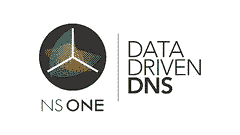

# 构建全球分布式，关键任务应用程序：Trenches 部分的经验教训 1

> 原文： [http://highscalability.com/blog/2015/8/31/building-globally-distributed-mission-critical-applications.html](http://highscalability.com/blog/2015/8/31/building-globally-distributed-mission-critical-applications.html)

*这是 [Kris Beevers](https://www.linkedin.com/pub/kris-beevers/4/a5/113) 的创始人和首席执行官， [NSONE](https://nsone.net/) 的来宾帖子的第 1 部分，下一代智能 DNS 和流量管理平台的提供者。 这是[第 2 部分](http://highscalability.com/blog/2015/9/2/building-globally-distributed-mission-critical-applications.html)。*

每家科技公司都考虑到这一点：随着业务的增长，扩展其应用程序和系统是不可避免的（实际上是令人羡慕的）挑战。 **您如何从一开始就考虑扩展规模，并在不进行过早优化的情况下使公司处于良好的地位？** 在以后咬你之前，有哪些值得考虑的关键挑战？ 当您构建关键任务技术时，这些是基本问题。 在构建分布式基础架构时，无论是可靠性还是性能，或者两者兼而有之，它们都是很难回答的问题。

部署正确的体系结构和流程将使您的系统和公司能够抵御分布式，高流量应用面临的常见问题。 这使您能够超越扩展限制，管理不可避免的网络和系统故障，保持冷静并实时调试生产问题，并成功地发展公司和产品。

## 这是谁？

我长期以来一直在构建遍布全球的大型应用程序。 在第一次互联网泡沫时期，我坚持了一年的大学课程，并为一个文件共享创业公司建立了后端基础架构，该公司成长为数百万用户-直到 RIAA 的律师们大吃一惊并将我们打包回到宿舍 。 公司倒闭了，但我却迷上了规模。

最近，在 Internap 于 2011 年收购的互联网基础架构提供商 Voxel 上，我建立了许多大型 Web 公司使用的全球互联网基础架构–我们建立了全球分布式公共云，裸机即服务，内容交付 网络等等。 我们学到了很多扩展课程，并且很难学到它们。

现在，我们在 NSONE 上建立了下一代智能 DNS 和流量管理平台，该平台今天为 Internet 上一些最大的属性提供服务，其中包括许多本身就是关键任务服务提供商的公司。 这是真正分布在全球的关键任务基础架构，在我们构建和扩展 NSONE 平台时，我们在 Voxel 上学到的经验为我们提供了很好的服务-并一次又一次得到了加强。

现在该分享一些我们所学的知识，并且很幸运，也许您可​​以在自己的应用程序中应用这些课程中的一些–而不是艰难地学习它们！

## 架构优先

编写代码时，总是很想集中精力使其变得紧凑和高效，最大限度地减少内存和 CPU 消耗，最大程度地提高软件的“深度”。 停下来。

在现代的，分布广泛的系统中，扩展限制几乎不受系统的垂直“深度”和特定角色内的代码优化（尤其是早期）的驱动。 相反，它们是管理交互系统之间的通信以及体系结构中每个角色的水平可伸缩性。 **不要优化您的代码，请优化您的架构。**

[微服务](https://en.wikipedia.org/wiki/Microservices) 是个好主意。 它们使应用程序中的独立角色脱钩，并使您能够独立扩展每个角色或层。 **在担心深度之前，计划水平扩展角色。 服务器既便宜又便宜，而且总是越来越便宜。 开发人员时间不是。** 因此，您可以随时进行水平缩放，而仅在找到真正重要的地方时才担心代码优化。

在编写一行代码之前，请花时间考虑一下您的体系结构。 绘制图表，考虑通信和数据约束，并制定计划。

## 从角色上考虑您的系统

微服务架构或多或少意味着您正在构建一个由解耦系统组成的应用程序，每个系统都解决一个特定的问题或扮演特定的角色。 但是值得重复的是，您应该以这种方式考虑您的体系结构。 b 不仅因为它**消除了扩展约束，还因为它影响了您开发代码，部署系统和扩展基础结构的方式**。

由相互分离，相互通信的角色组成的应用程序可以作为进程，VM 或容器并置放置在单个服务器上。 这使您可以在本地开发环境，小型登台系统和大型生产基础架构中部署应用程序。

**随着应用程序生产基础架构的发展以及流量和用户的扩展，您可以剥离需要专用系统或系统集群的角色。** 。但是，在您的 MVP 中，您可以将成本降到最低，并且仍然可以通过并置生产角色来进行扩展。 我们在 NSONE 上发布的最早的 alpha 版本托管在 AWS 中的一个单播 t2.small 实例上。 如今，我们具有与开始时基本相同的角色和子系统集（此后又添加了更多的角色和子系统），我们的生产基础架构跨越全球各大洲的数百台服务器和近 30 个不同的生产设施（南极洲除外-抱歉 伙计们）。 随着我们的成长，我们将关键子系统剥离到了它们自己的服务器或群集，并在需要的地方增加了广度和冗余性。

## 跨全球分布式系统的通信非常困难

构建和扩展由子系统组成的应用程序是一回事，这些子系统最初并置在单个服务器上，最终并置在单个数据中心中。 完全解决多数据中心应用交付难题是另一回事。 子系统需要在 LAN 外部进行通信时，该通信的可靠性将大大降低，您不仅需要针对服务器故障，而且还要针对通信故障进行周密的计划。

Internet 上的连接脆弱且不可预测。 在 NSONE，我们设计架构的前提是我们的边缘 DNS 交付设施将经常失去与核心设施的连接。 在非洲，巴西和印度等困难的市场中，情况尤其如此。 但是我们还需要确保在恢复通信后快速重新收敛。 仔细考虑命令和控制消息传递以及消息排队是关键。

对于不同的通信模式，以不同的方式考虑设施间通信也很重要。 **如果要将延迟敏感的关键命令和控制消息推送到一个或多个设备，则可能需要查看功能强大的消息队列系统**（例如，我们大量使用 RabbitMQ）。 如果要将非关键遥测回运到仪表板系统，则**可能会考虑减轻重量，但对网络拆分的影响较小**。 如果您要推送需要在所有交付位置之间紧密同步的持久性应用程序数据，则值得一看。 在设施之间移动钻头时，请使用正确的工具完成正确的工作。

## 一致性哈希是同步&分片的杀手 tool

是时候考虑水平缩放了。 您有一堆子系统，它们都在本地和整个 Internet 上相互通信。 请求飞入您的系统，需要在可以有效地为它们服务的后端节点之间分配，并且您需要一种最大化“请求位置”的方法。 不能期望您所有具有特定角色的服务器都能满足任何请求，这可能是因为必需的数据不能全部存储在一个盒子中的 RAM 中，或者您需要在服务器之间有效地分条存储。 您如何确定水平层中的哪个节点应处理请求或任务？

天真的，您可以预先配置请求路由：也许您有一个请求 ID，并且所有以 A-M 开头的请求 ID 都被带到一台服务器，而以 N-Z 开头到另一台服务器。 那可能行得通，但是难以管理和扩展。 您可以将请求 ID 散列到服务器：类似 hash（id）mod N ，其中 N 是要跨越的服务器数量。 在您添加新服务器并且所有请求重新进行条带化，破坏数据或缓存局部性并破坏系统之前，这种方法很有效。 您可以为分布式“协议”实施某种复杂的协商-您的各个子系统和服务器相互通信，以确定哪些请求应该发送到哪里-这是我经常看到的一种方法。 这很复杂，事情会破裂。

[一致性哈希](https://en.wikipedia.org/wiki/Consistent_hashing) 是一种强大的方式，使分布式系统无需进行实际通信就可以达成对请求到节点的映射等协议。 它易于实施，并且可以根据您的基础架构进行适当扩展，从而最大程度地减少了在子系统中添加或删除节点时的重新分段。 在具有许多交互角色的复杂体系结构中，策略性地使用一致的哈希来跨节点集对消息和请求进行条带化可能是一个巨大的胜利。

在 NSONE，**我们以多种方式在整个堆栈中使用一致的哈希，例如将 DNS 查询路由到特定的 CPU 内核以最大化缓存局部性，在不进行显式通信的情况下协商监视节点的任务，跨层拆分大量数据馈送 聚合节点的数量，还有更多**。

## 测量并监视所有内容

这是一条很常见的建议，似乎有些陈词滥调，但它总是值得重复的。 **您没有测量的内容，您无法理解**。 即使您远未遇到严重的扩展挑战，对系统行为及其交互的深入了解对于了解随着增长将面临的扩展约束也至关重要。

不只是收集系统指标。 **对您的应用程序进行检测，以了解数据库响应时间，消息传递延迟，高速缓存命中率，内存碎片，磁盘 I / O，以及可能使您洞悉系统性能的所有内容。** 绘制所有图表，并建立对“名义”行为的基本理解。 如果发生异常情况（例如负载峰值，通信故障，子系统中出现某种异常情况），请回头查看您的指标并了解事件的“特征”。 这将帮助您识别将来异常情况下正在发生的事情（同样重要的是，排除不发生的事情）。 它会帮助您了解新型工作负载或其他流量何时给系统带来了意料之外的压力，因此您可以在子系统发生故障之前适当地调整架构或扩展子系统。

在 NSONE，**我们研究了指标。** 始终在显示它们（我们的办公室到处都是显示 NOC 仪表板的监视器）。 当我们看到一些突如其来的东西时，我们会问为什么，并进行更深入的挖掘。 从这种方法中获得的深刻理解意味着我们可以放心地满足 Internet 上最大客户的 DNS 和流量管理需求，因为我们知道我们的平台将如何应对新的流量和工作量。

**与测量同样重要的是监视**。 这是两个不同的事物：我们进行测量以了解我们系统的行为，并且进行监视以检测该行为中的异常。 在您的成长早期就进行监视和警报：它将帮助您了解重要的异常和无关紧要的异常。 您才刚刚开始，可能会错过一些睡眠。 后来，随着业务的增长，管理系统变得比马拉松跑更像一场马拉松，您将希望减少噪音，着眼于影响服务的异常情况，并对系统进行自动化和重新架构以将其最小化。

**从多个有利位置**进行监视-不仅在物理上（多个地理位置和网络），而且在逻辑上。 在 NSONE，我们监视内部遥测中的异常情况，利用 Catchpoint 和 Raintank 等第三方服务进行外部监视，并通常利用各种数据源来观察平台和网络事件。

同样重要的是，**监视的不仅仅是系统**的“正常性”。 系统提供“优质”服务意味着什么？ 低延迟响应时间？ 高缓存命中率？ 监视那些指标并在它们超出范围时发出警报。

*这是本文的[第 2 部分](http://highscalability.com/blog/2015/9/2/building-globally-distributed-mission-critical-applications.html)。*

## 相关文章

*   [关于黑客新闻](https://news.ycombinator.com/item?id=10147420)

很棒的文章！ 我特别指出，内部遥测和外部监视之间存在差异。 这是我最近与一位近视的领导者失去的论点-他关闭了内部遥测系统以节省几分钱。 但是自那以后，我离开了那家公司，我希望从长远来看，这将使他们停机。