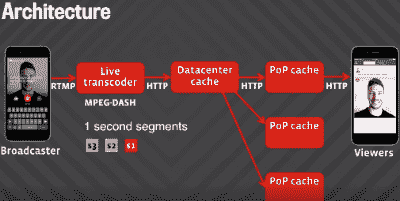
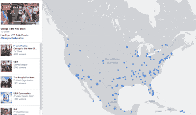

# Facebook 如何向 80 万同时观看者直播

> 原文： [http://highscalability.com/blog/2016/6/27/how-facebook-live-streams-to-800000-simultaneous-viewers.html](http://highscalability.com/blog/2016/6/27/how-facebook-live-streams-to-800000-simultaneous-viewers.html)

与拥有 [以及](https://www.sipri.org/media/press-release/2014/nuclear-forces-reduced-while-modernizations-continue-says-sipri) 核武器的国家相比，很少有公司知道如何建立全球性的分布式服务。 Facebook 是其中一家公司， [Facebook Live](https://www.facebook.com/livemap/) ，Facebook 的 [新](https://live.fb.com/about/) 实时视频 流产品，就是这些服务之一。

Facebook CEO [马克·扎克伯格](https://www.buzzfeed.com/mathonan/why-facebook-and-mark-zuckerberg-went-all-in-on-live-video)：

> 我们做出的重大决定是将我们的许多视频工作重点转移到 Live 上，因为这是一种新兴的新格式； 而不是过去五到十年一直在线的那种视频……我们正在进入视频的新黄金时代。 如果您快进五年，人们在 Facebook 上看到并每天分享的大部分内容都是视频，那我不会感到惊讶。

如果您从事的是广告业务，那么比提供永无止境，始终在扩展且可以自由生成的广告就绪内容更好的是什么？ 当 Google [开始在呈指数级增长的网络上投放广告时，就利用了](http://www.wsj.com/articles/SB108319881076696889) 的经济学。

Facebook 的流媒体表演的一个例子是两个人在 45 分钟的视频中 [用橡皮筋爆炸西瓜](https://www.buzzfeed.com/brendanklinkenberg/this-exploding-watermelon-was-facebook-lives-biggest-hit-to) 。 它达到了超过 80 万同时观看者的顶峰，这些评论者还收集了 30 万以上的评论。 这就是您可以通过拥有 15 亿用户的社交网络产生的病毒规模。

作为比较 [1.14 亿](http://www.statista.com/statistics/216526/super-bowl-us-tv-viewership/) 观看了 2015 年超级碗的观众，平均 [观看者有 236 万 实时流中的](http://money.cnn.com/2015/10/26/media/nfl-yahoo-live-stream-results/) 。 Twitch 的 [840,000](http://www.geekwire.com/2015/amazons-twitch-attracts-monster-audience-at-e3-with-21m-viewers-tuning-in-online/) 观众人数在 2015 年 E3 达到顶峰。9 月 16 日的共和党辩论在 [921,000 达到顶峰 ]](http://www.politicususa.com/2015/10/14/debate-watched-democratic-debate.html) 同时直播。

因此，Facebook 处于最新状态。 请记住，Facebook 也会同时有大量其他流。

有线文章 [引用了](http://www.wired.com/2016/04/facebook-really-really-wants-broadcast-watch-live-video/) Facebook 首席产品官 Chris Cox，他说 Facebook：

*   拥有**个以上的一百人**进行直播。 （[从[12]开始](https://www.buzzfeed.com/mathonan/why-facebook-and-mark-zuckerberg-went-all-in-on-live-video)，现在该项目有 150 多名工程师）

*   需要能够提供**数百万个同时流**而不会崩溃。

*   需要能够在流上支持**数百万同时观看者，以及全球不同设备和服务提供商之间的无缝流。**

Cox 说：“事实证明这是一个非常困难的基础架构问题。”

如果我们有一些有关如何解决该基础结构问题的详细信息，这会很有趣吗？ 祸是我们。 但是等等，我们做到了！

[Federico Larumbe](https://www.linkedin.com/in/federicolarumbe) 来自 Facebook 的流量小组，该小组致力于为 Facebook 的 CDN 和全球负载平衡系统提供支持的缓存软件，并发表了精彩的演讲： [扩展 Facebook Live](https://code.facebook.com/posts/1036362693099725/networking-scale-may-2016-recap/) ，他在其中分享了有关 Live 工作方式的一些详细信息。

这是我在演讲中的发言。 令人印象深刻

## 起源故事

*   Facebook 是一项新功能，允许人们实时共享视频。 （请注意，这对于 Facebook 来说只是另一个功能）。

*   于 2015 年 4 月推出，只有名人才能通过 [提及应用程序](https://www.facebook.com/about/mentions/) 用作与粉丝互动的媒介。

*   这是产品改进和协议迭代开始的一年。

    *   他们以 HTTP 实时流媒体 [HLS](https://en.wikipedia.org/wiki/HTTP_Live_Streaming) 开头。 它受 iPhone 支持，并允许他们使用现有的 CDN 架构。

    *   同时开始研究 [RTMP](https://en.wikipedia.org/wiki/Real_Time_Messaging_Protocol) （实时消息协议） ，这是一种基于 TCP 的协议。 从电话发送到实时流服务器的是视频流和音频流。

        *   优点：RTMP 在广播者和观看者之间具有较低的终端等待时间。 在人们相互交流的交互式广播中，这确实有所作为。 然后，降低等待时间并减少几秒钟的延迟，将使体验完全不同。

        *   劣势：由于它不是基于 HTTP 的，因此需要一个完整的体系结构。 需要开发新的 RTMP 代理以使其扩展。

    *   还研究了 [MPEG-DASH](https://en.wikipedia.org/wiki/Dynamic_Adaptive_Streaming_over_HTTP) （基于 HTTP 的动态自适应流）。

        *   优势：与 HLS 相比，它的空间效率高 15％。

        *   优点：它允许自适应比特率。 编码质量可以基于网络吞吐量而变化。

    *   [吹笛者中出压缩解决方案](https://www.crunchbase.com/organization/pied-piper#/entity) ：（开个玩笑）

*   于 2015 年 12 月在数十个国家推出。

## 实时视频与众不同，这会引起问题

*   前面提到的西瓜视频的流量模式：

    *   最初的上升非常陡峭，在几分钟之内达到了每秒 100 多个请求，并持续增长直到视频结束。

    *   然后，流量像石头一样下降。

    *   换句话说：流量很尖。

    

*   实时视频与普通视频不同：它会导致**尖峰** **流量模式**。

    *   实时视频更具吸引力，因此观看**的**比普通视频多 3 倍。

    *   实时视频出现在新闻源的顶部，因此被观看的可能性更高。

    *   通知会发送到每个页面的所有粉丝，以便另一组可能会观看视频的人。

*   高峰流量会导致缓存系统和负载平衡系统出现问题。

*   **缓存问题**

    *   很多人可能希望同时观看直播视频。 这是您的经典 [雷电牧群问题](https://en.wikipedia.org/wiki/Thundering_herd_problem) 。

    *   尖刻的流量模式给缓存系统带来压力。

    *   视频被分割成一秒钟的文件。 当流量激增时，缓存这些段的服务器可能会过载。

*   **全局负载平衡问题**

    *   Facebook 在全球分布 [个存在点](https://en.wikipedia.org/wiki/Point_of_presence) （PoP）。 Facebook 流量在全球范围内分布。

    *   挑战在于防止峰值导致 PoP 过载。

## 大图片架构

这就是直播流从一个广播公司到数百万观众的方式。

*   广播员在其手机上开始直播视频。

*   手机将 RTMP 流发送到实时流服务器。

*   实时流服务器解码视频并将代码转换为多个比特率。

*   对于每个比特率，都会连续生成一秒的 MPEG-DASH 段。

*   段存储在数据中心缓存中。

*   来自数据中心的缓存段被发送到位于存在点的缓存（PoP 缓存）。

*   观看者在观看时会收到一个实时故事。

*   他们设备上的播放器开始以每秒 1 个的速率从 PoP 缓存中获取片段。

## 它如何缩放？

*   数据中心高速缓存与**许多 PoP 高速缓存**之间有一个**乘法点**。 用户访问 PoP 缓存，而不是数据中心，并且全世界分布着许多 PoP 缓存。

*   另一个乘数是每个 PoP 中的**。**

    *   在 PoP 内有**两层**：一层 HTTP 代理和一层缓存。

    *   查看器从 HTTP 代理请求段。 代理检查该段是否在缓存中。 如果它在缓存中，则返回该段。 如果不在缓存中，则将对该段的请求发送到数据中心。

    *   不同的**段存储在不同的缓存**中，从而有助于跨不同的缓存主机进行负载平衡。

## 保护数据中心免受雷电袭击

*   当所有观众同时请求相同的片段时会发生什么？

*   如果该段不在缓存中，则将向每个查看器发送一个请求到数据中心。

*   **请求合并** 。 通过将请求合并添加到 PoP 缓存中，减少了请求数量。 仅第一个请求发送到数据中心。 其他请求将一直保留，直到第一个响应到达并将数据发送给所有查看者为止。

*   新的缓存层已添加到代理，以避免 **Hot Server 问题**。

    *   所有查看器都发送到一个缓存主机，以等待该片段，这可能会使主机过载。

    *   代理**添加了缓存层**。 实际上，只有第一个对代理的请求才向缓存发出请求。 以下所有请求均直接从代理服务。

## PoP 仍处于危险之中-全局负载平衡可拯救

*   因此，可以保护数据中心免受雷电群问题的影响，但是 PoP 仍然处于危险之中。 Live 的问题是尖峰非常大，以致 PoP 可能在 PoP 的负载度量达到负载平衡器之前过载。

*   每个 PoP 具有数量有限的服务器和连接性。 如何防止峰值导致 PoP 过载？

*   名为 Cartographer 的系统将 Internet 子网映射到 PoP。 它测量每个子网和每个 PoP 之间的延迟。 这是延迟测量。

*   测量每个 PoP 的负载，并将每个用户发送到具有足够容量的最近 PoP。 代理中有一些计数器可以衡量它们承受的负载量。 这些计数器是聚合的，因此我们知道每个 PoP 的负载。

*   现在存在一个优化问题，该问题会考虑容量限制并最大程度地减少延迟。

*   使用控制系统时，存在测量延迟和反应延迟。

*   他们将负载测量窗口从 1.5 分钟更改为 3 秒，但仍然有 3 秒的窗口。

*   解决方案是在实际发生负载之前 **预测负载** 。

*   实施了**容量估算器**，将每个 PoP 的先前负载和当前负载外推到未来负载。

    *   如果负载当前正在增加，预测器如何预测负载将减少？

    *   **三次样条**用于 [插值](https://en.wikipedia.org/wiki/Spline_interpolation) 功能。

    *   取一阶和二阶导数。 如果速度为正，则负载将增加。 如果加速度为负，则表示速度正在降低，最终将为零并开始降低。

    *   三次样条比线性插值预测更复杂的交通模式。

    *   **避免振荡** 。 此插值功能还解决了振荡问题。

    *   测量和反应的延迟意味着对过时的数据做出决策。 插值可减少误差，更准确地进行预测并减少振荡。 因此负载可以更接近目标容量

    *   当前预测基于 最近的三个间隔 ，其中每个间隔为 30 秒。 几乎是瞬时负载。

## 测试

*   您需要能够使 PoP 过载。

*   构建了一个负载测试服务，该服务在 PoP 上全局分布，以模拟实时流量。

*   能够模拟 10 倍的生产负荷。

*   可以模拟一次请求一个片段的查看器。

*   该系统有助于揭示和修复容量估计器中的问题，以调整参数并验证缓存层是否解决了雷电群问题。

## 上传可靠性

*   实时上传视频具有挑战性。

*   以具有 100 至 300 Kbps 可用带宽的上载为例。

*   音频需要 64 Kbps 的吞吐量。

*   标清视频需要 500 Kbps 的吞吐量。

*   手机上的自适应编码用于调整视频+音频的吞吐量不足。 视频的编码比特率根据可用的网络带宽进行调整。

*   决定上传比特率的方法是在手机中通过测量 RTMP 连接上的上传字节来完成，并且对最后间隔进行加权平均。

## 未来方向

*   研究一种推送机制，而不是请求拉机制，利用 HTTP / 2 在请求分段之前将其推送到 PoP。

## 相关文章

*   [关于 HackerNews](https://news.ycombinator.com/item?id=11987654)

*   [扩展 Facebook Live](https://code.facebook.com/posts/1036362693099725/networking-scale-may-2016-recap/)

*   [为什么 Facebook 和 Mark Zuckerberg 都参与直播视频](https://www.buzzfeed.com/mathonan/why-facebook-and-mark-zuckerberg-went-all-in-on-live-video)

*   [连通世界：Facebook 的网络基础架构](http://cs.unc.edu/xcms/wpfiles/50th-symp/Moorthy.pdf)

*   [Gamoloco](https://gamoloco.com/) 跟踪 1476093 个频道的实时视频统计信息。

Google Chrome 浏览器告诉我您的网站已感染恶意软件。 也许是个调皮的广告？

我很乐意在具有如此高流量的平台上工作。 12 位工程师可以毫无问题地做到这一点。 很少有人可以在应用程序上工作，甚至可以进行额外的数据压缩，而在主平台上则很少。 我什至可以处理 100-200k 观众的实时视频流，唯一的限制是资金有限；）我仍然不明白 150 名工程师在此方面的工作...
一如既往的好文章，我 很抱歉，我目前没有客户，流量非常大。

150 名工程师可以同时建立 10 个创业公司！ 没有留下深刻印象。

我不知道为什么 Google 网站管理员工具 Dobes 会显示该网站存在我什至无法在该网站上找到的问题，但是却没有说出它是否带有恶意软件。

我不知道 Facebook 工程师的自我来自何处。 毫无疑问，这是一个很难解决的问题，但我认为这与核武器的复杂性不相上下。

Facebook live 的问题都不是新问题。 它们是成熟的技术，许多公司已经多次解决了它们。

规模仍然非常可观，我想你们应该专注于此。

我对 MPEG-DASH 感到担心，“它允许自适应比特率。编码质量可以根据网络吞吐量而变化”。 那是优点还是缺点？ 谢谢。

自适应比特率通常被认为是一个优势，因为只要带宽高于最小比特率，流就不会中断。

顺便说一下，就我所知，MPEG-DASH 与 HLS 本质上相同，都允许自适应比特率。