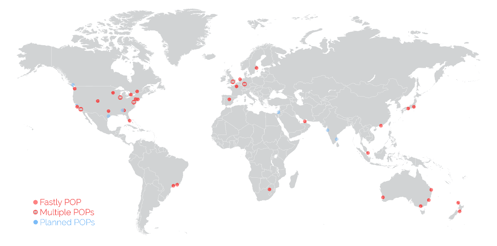

# ButterCMS 体系结构：关键任务 API 每月可处理数百万个请求

> 原文： [http://highscalability.com/blog/2017/10/16/buttercms-architecture-a-mission-critical-api-serving-millio.html](http://highscalability.com/blog/2017/10/16/buttercms-architecture-a-mission-critical-api-serving-millio.html)

*这是 [Jake Lumetta](https://twitter.com/jakelumetta) 的来宾帖子， [ButterCMS  。*

[ButterCMS](https://buttercms.com/) 使开发人员可以在几分钟内将内容管理系统添加到任何网站。 我们的业务要求我们为 API 提供近 100％的正常运行时间，但是在多次中断几乎使我们的业务瘫痪之后，我们开始着迷于消除单点故障。 在这篇文章中，我将讨论如何快速使用 的边缘云平台和其他策略，以确保我们保持客户网站的正常运行 。

ButterCMS 的核心功能是：

*   内容编辑器的仪表板

*   一个 [JSON API](https://buttercms.com/docs/api/) ，用于获取内容

*   [SDK，用于将 ButterCMS](https://github.com/buttercms) 集成到本机代码中

## ButterCMS 技术堆栈

ButterCMS 是一个单一的 Django 应用程序，负责营销网站，编辑工具，API 和后台工具，以提供客户支持。 Django 应用程序与 Postgres 数据库一起在 Heroku 上运行。

我们还利用以下第三方服务：

*   [文件堆栈](https://www.filestack.com/) 用于为其客户提供图像编辑功能

*   [快速](https://www.fastly.com/) 用于外部 API 缓存和交付

*   [Cloudfront](https://aws.amazon.com/cloudfront/) 作为客户资产的 CDN

*   用于 DNS 的 [EasyDNS](https://www.easydns.com/)

## 停机时间是致命的

我们的客户通常会建立在请求/响应生命周期内向 ButterCMS 发出 API 请求以获取页面内容的网站。 这意味着，如果他们对 ButterCMS 的 API 请求失败，则他们的页面可能无法呈现。 如果我们的 API 出现故障，那么客户的网站也会与我们发生故障。

这是我们在早期学习的艰辛课程。 不可靠的服务器托管导致频繁的间歇性停机和性能下降，使客户感到沮丧。 糟糕的 DNS 迁移导致 API 停机数小时，从而使数十个客户的网站瘫痪了近半天，并使大量客户质疑他们是否可以继续依赖我们（其中有少数人离开了我们）。

在此事件之后，我们意识到确保接近 100％的正常运行时间是一个存在的问题。 未来发生的重大故障可能导致我们失去来之不易的客户，并使我们的业务陷入危机。

## 提供全局，快速，弹性的 API

无法完全避免失败-您只能尽力减少机会。

例如，通过运行自己的物理服务器来“控制自己的命运”可以保护您的主机提供商免受崩溃的困扰，但是却使您处于必须处理安全性和可伸缩性的位置，这两者都可以轻松使您崩溃并 很难恢复。

对于我们的团队而言，始终保持 API 的正常运行并确保其在全球范围内提供高性能至关重要。 但是作为一家较小的公司，我们知道我们没有足够的资源来提供具有近 100％正常运行时间的全球性，高度可扩展的性能。 因此，我们转向了这样做的人： [快速](https://www.fastly.com/) 。

迅速将自己描述为“为全球最受欢迎的企业提供快速，安全和可扩展的数字体验的边缘云平台”。 他们与包括《纽约时报》，BuzzFeed，Pinterest 和 New Relic 等大型客户合作。 我们将 Fast 放在我们的 API 前面作为缓存层，以便所有 API 请求都通过其 CDN 进行处理。 

当我们的一位客户在 ButterCMS 中更新其网站内容时，我们将使已编辑内容的特定位的 API 密钥无效。 非缓存的请求命中了我们的服务器，但命中率达到了 94％，因为客户网站上的内容相对于获得的访问者数量很少变化。 这意味着，即使我们的数据库或服务器遇到间歇性的中断，我们的 API 仍然可以运行。 我们不希望这样，但是从理论上讲，只要 Fastly 保持正常运行，服务器可能会完全瘫痪几个小时，而且客户的网站也会保持正常运行。

Fastly 的全球 CDN 为我们带来了另一个好处。 我们的许多客户都有静态 JavaScript 网站，这些 API 网站的访问者访问者是浏览器而不是服务器。 通过 Fastly 的 CDN 提供 API 响应，意味着我们的客户的网站访问者无论身在何处，都能获得快速的加载时间。

## 消除单点故障

在 ButterCMS 成立之初，我们处理了两次单独的 DNS 事件，这使我们感到恐惧。 在第一起事件中，我们的 DNS 提供商当时不小心从其系统中“取消”了我们的帐户，导致断电花费了将近 6 个小时才能使我们完全恢复。 我们的第二次事件发生在常规 DNS 编辑导致我们的[不同的] DNS 提供程序发生故障时，并且花费了将近半天的时间来解决。 DNS 事件尤其具有破坏性，因为即使在确定并解决问题后，您也必须等待各种 DNS 服务器和 ISP 清除缓存，然后客户才能看到解决方案（DNS 服务器也倾向于忽略您的 TTL 设置并强加 他们自己的政策）。

我们的经验使我们非常专注于消除整个体系结构中的任何单点故障。

对于 DNS，我们切换为使用来自不同 DNS 提供商的多个名称服务器。 DNS 提供程序通常允许并鼓励您使用 4-6 个冗余名称服务器（例如 ns1.example.com，ns2.example.com）。 很好：如果一个请求失败，其他请求仍然可以解决。 但是，由于您所有的名称服务器都来自同一家公司，因此您非常相信他们将拥有 100％的正常运行时间。

对于我们的应用服务器，我们使用 Heroku 的监控和 [自动缩放](https://blog.heroku.com/heroku-autoscaling) 工具，以确保我们的性能不会因流量高峰（或 如果快速崩溃，我们突然需要将所有请求直接路由到我们的服务器）。 除了使用 Fastly 缓存 API 外，我们还使用 Memcached 在应用程序级别缓存 API。 这为间歇性数据库或服务器故障提供了额外的缓冲层。

为防止在 Heroku 或 AWS（Heroku 运行于其上）之间发生极少数情况下的总停机，我们在 Google Cloud 上维护了单独的服务器和数据库实例，可以将其快速故障转移。

## 不可避免的是失败

不管我们的 API 有多可靠，我们都必须接受 [不可靠的网络](https://en.wikipedia.org/wiki/Fallacies_of_distributed_computing) ，并且网络肯定会发生故障。 我们所有人在连接 Wi-Fi 时都遇到了麻烦，或者突然打了个电话。 从统计上讲，中断，路由问题和其他间歇性故障在总体上可能是异常的，但始终会始终以某个环境本底速率发生。

为克服这种本质上不可靠的环境，我们帮助客户构建在出现故障时将变得可靠的应用程序。 我们的 SDK 提供的功能，例如 [在 API 请求失败时自动重试](https://github.com/ButterCMS/buttercms-csharp/pull/2) 或 [支持，可轻松使用故障转移缓存](https://github.com/ButterCMS/buttercms-ruby#fallback-data-store) ，例如客户端上的 Redis。

## 结论

没有意识到这一点，我们中的许多人正在将单点故障构建到我们的堆栈中。 在 ButterCMS，我们的成功取决于确保客户的应用程序不会因为我们而出现故障。 为此，我们从后端基础架构中消除了尽可能多的单点故障，并提供了 SDK，可让我们的客户轻松实现其应用程序中的弹性和容错能力。

### 关于 ButterCMS

当您听到“ CMS”或“博客”消息时，您可能会想到 WordPress。 ButterCMS 是一种较新的替代方法，它允许开发团队使用 ButterCMS API 将 CMS 和博客功能添加到他们自己的本机代码库中。

ButterCMS 由 [Jake Lumetta](https://twitter.com/jakelumetta) 和 [Abi Noda](https://twitter.com/abi) 发起，因为他们俩都遇到了寻找功能齐全，灵活且未将您绑定到特定 WordPress 的替代品的挑战 像 PHP 这样的编程语言..

如今，ButterCMS 为全球数百个网站提供支持，每月帮助处理数百万个请求。

你好杰克，

在本文中，我看到两个语句。
->快速用于外部 API 缓存和交付

-> Cloudfront 作为客户资产的 CDN

是否有特定原因将 Cloud Front 用作客户资产？ 为什么我们不能快速使用 CDN？