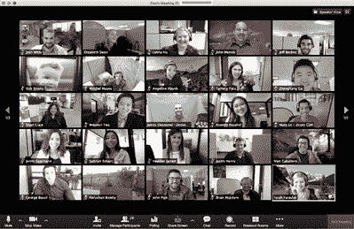

# 缩放原理

> 原文： [http://highscalability.com/blog/2020/5/14/a-short-on-how-zoom-works.html](http://highscalability.com/blog/2020/5/14/a-short-on-how-zoom-works.html)

整个晚上，Zoom 的规模从 2000 万增加到 3 亿。 令人难以置信的是，从外部看，他们并没有表现出明显的成长痛苦，尽管在内部，这是一个很好的押注，很多疯狂还在发生。

当然，Zoom 做出了一些设计决策，这些决策对于一个小型的，不起眼的初创公司来说是有意义的，但作为事实上的标准并没有多大意义，但这是可以预期的。 正如许多人所建议的，这并不是不良体系结构的迹象。 这实际上是产品的演变方式，尤其是当它们必须在数周，数天甚至数小时内提升时。

突然的成功需要进行仔细的审查，因此每个人都想知道 Zoom 的工作原理。 问题是我们了解的不多，但是我们确实有一些信息来源：

*   [缩放方式可提供业界领先的视频容量](https://blog.zoom.us/wordpress/2019/06/26/zoom-can-provide-increase-industry-leading-video-capacity/)
*   [给我们用户的消息](https://blog.zoom.us/wordpress/2020/04/01/a-message-to-our-users/)
*   一年前的营销视频 [Zoom 独特的体系结构如何为您的视频带来最大的 UC 未来](https://www.youtube.com/watch?v=5BMbsFqtD0A)
*   2016 年关于[的文档全球基础设施和安全指南](https://zoom.us/docs/doc/Zoom_Global_Infrastructure.pdf)
*   已有一年的新闻稿 [Zoom 借助 Equinix 扩展，以适应未来需求并扩展其视频优先，云原生架构](https://www.prnewswire.com/news-releases/zoom-expands-with-equinix-to-future-proof-and-scale-its-video-first-cloud-native-architecture-300962299.html)
*   [Zoom CFO 解释了公司如何应对不断增长的需求](https://www.cnbc.com/2020/03/18/zoom-cfo-explains-how-the-company-is-grappling-with-increased-demand.html)
*   在线问& A [问 Eric 任何问题](https://www.youtube.com/watch?v=tlC-sEdqY48)
*   AWS 说[大多数 Zoom 运行在 AWS 上，而不是 Oracle 上](https://www.datacenterdynamics.com/en/news/most-zoom-runs-aws-not-oracle-says-aws)

以下是其中一些来源的介绍：

*   有关 Zoom 的数据中心使用情况有很多争论。 最终的结果是，他们从自己的共享空间开始，然后随着增长的高峰而扩展以使用多个云。 几乎教科书的执行如何处理突如其来的增长。
*   [大多数 Zoom 都在 AWS 上运行，而不是在 Oracle 上运行-AWS 说](https://www.datacenterdynamics.com/en/news/most-zoom-runs-aws-not-oracle-says-aws)：自大流行到来以来，该服务已将大量实时视频会议流量移至 AWS 上，并且容量也有所减少 在 Oracle Cloud 上...首席执行官 Eric Yuan 进一步澄清了这一点，解释说 Zoom 过去在“自己的数据中心”中处理实时视频会议流量...我们的实时流量始终留在我们自己的数据中心内 对于我们的付费客户...在这场大流行危机期间，每天都是新的记录。 我们自己的现有数据中心实际上无法处理此流量...这意味着 AWS 每天都会为 Zoom 旋转成千上万的新服务器...因此最终，我们自己的数据中心（主要是 Amazon）以及 在 Oracle 云中，这三者共同为所有前所未有的流量提供服务。
*   我们对 Zoom 的架构知之甚少，但此营销视频进行了一些详细介绍： [Zoom 独特的架构如何为您的视频带来最大的 UC Future](https://www.youtube.com/watch?v=5BMbsFqtD0A) 。
*   Zoom 将其架构视为竞争优势。 每个人都将使用视频，那么我们如何扩展到每个人？ 因此 Zoom 始于无处不在的视频目标，并让该目标塑造了他们的架构。
*   竞争对手通过数据中心进行长号通信，将其转码为其他人的普通视图，然后将混合视频发送给每个参与者。 这引入了延迟，使用了大量的 CPU 资源，并且很难扩展和部署新的数据中心来满足增加的负载。
*   Zoom 选择了 AVC 上的 SVC（可伸缩视频编解码器）编解码器。 AVC 是一种协议，您在其中发送单个流，并且单个流具有比特率。 如果要发送多个比特率，则必须发送多个流。 如果要发送多个比特率，这会增加带宽利用率。
*   SVC 是具有多个层的单个流。 这样就可以发送 1.2 mbs 的流，该流具有您可能需要缩小到给定网络条件的所有分辨率和比特率。 过去，您只能使用 ASIC 进行 SVC。 现在，由于摩尔定律，SVC 可以用软件完成。
*   Zoom 创建了多媒体路由，以解决传统供应商在 AVC 中遇到的问题。 消除转码摆脱了等待时间并增加了规模。
*   多媒体路由会将用户内容带入他们的云中，当您作为客户端遇到问题时，他们会将另一个视频流切换给您。 如果您需要其他分辨率，则可以订阅该人分辨率的另一层。
*   缩放不会转码或混合任何内容或形成任何视图。 从字面上看，您实际上是从零处理的路由中直接提取多个人的多个流。 这就是为什么您会看到如此出色的用户切换和语音切换体验以及低延迟的原因。
*   Zoom 开发了在云和客户端之间工作的应用程序层 QoS（服务质量）。 它的工作是检测网络状况。 收集的遥测数据确定将哪个流切换到客户端。 该算法查看 CPU，抖动，数据包丢失等情况。
*   客户与云对话。 云知道何时不返回某些数据包，因此它将做出决定并将另一种流切换到您。
*   如果网络环境不好，客户端可以自动缩小您自己的发送视频的大小，因此您不会浪费自己的下行带宽。
*   客户端和云协同工作，以在正确的网络上交付正确的音频流，正确的视频流，因此用户体验达到最佳状态。
*   具备网络意识意味着首先尝试最佳体验，即 UDP。 如果 UDP 不起作用，则尝试 HTTPS。 如果 HTTPS 不起作用，则会退回到 HTTP。 客户进行协商。 遥测表明为什么连接不良。 您能做的最糟糕的事情就是给用户带来不一致的体验。
*   重点是使所有事情都尽可能简单直观地工作。 强调并重复了这一点，这可以解释一些较早的设计决策。
*   在这一点上，讨论朝着更加注重市场的方向发展。
*   Zoom 通过 40 分钟的视频和聊天会议打乱了市场。 他们增加了免费的电话拨入式会议。 他们提供了市场上最好的 VOIP 体验。 竞争对手的平均 VOIP 采纳率不到 30％，缩放比例为 89％。 每年在音频会议上花费 30 亿美元，而 Zoom 免费提供它。 提供基于软件的视频会议室体验。 为竞争对手提供了一键式推送。 放弃数字标牌和房间展示。
*   Zoom 的竞争对手陷入了无法摆脱的收入模式。 不能创新，因为它们会破坏自己的收入模式。
*   Zoom 破坏了会议市场，音频市场，房间市场，现在他们想破坏电话。 尽管这是 2019 年，但随着大流行，该策略可能正在重新考虑。
*   Zooms 的目标是创建最大的互联协作网络。 他们希望兑现 20 年前 VOIP 的承诺，拆除人们相互协作的所有费用壁垒，推出 PSTN 连接性，通过聊天会议电话通过 IP 以任何网络上最低的速率连接所有人。

Zoom 如何满足如此巨大的带宽需求。 我不认为这是视频会议的中断，因为许多其他播放器已经以合理的成本结构提供了不错的视频内容，并且有些免费。
让我们不要将破坏与谋杀行业混为一谈。 中断是有价值的东西，因为它的第一款产品具有某些技术优势，而该技术以前并未实现过，并且可以帮助用户降低此类服务的成本或通过一些广告收入流免费提供这种服务（尽管不会窃取数据）。

Zoom 并未中断，但得到了贪婪的投资者的支持，先杀死了其他视频会议公司，然后在杀死了所有其他小型竞争对手以与 bluejeans 或 google 见面之战后，慢慢开始赚钱。