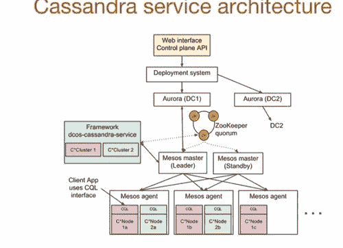

# Uber 如何使用 Mesos 和 Cassandra 跨多个数据中心每秒管理一百万个写入

> 原文： [http://highscalability.com/blog/2016/9/28/how-uber-manages-a-million-writes-per-second-using-mesos-and.html](http://highscalability.com/blog/2016/9/28/how-uber-manages-a-million-writes-per-second-using-mesos-and.html)

如果您是 Uber，并且需要存储驾驶员和驾驶员应用程序每 30 秒发送一次的位置数据，该怎么办？ 大量实时数据需要实时使用。

Uber 的解决方案是全面的。 他们构建了自己的系统，该系统在 Mesos 之上运行 Cassandra。 Uber 的软件工程师 [Abhishek Verma](https://www.linkedin.com/in/verma7) 在一个很好的演讲中都进行了解释： [Cassandra 在跨多个数据中心的 Mesos 上 Uber](https://www.youtube.com/watch?v=4Ap-1VT2ChU&feature=youtu.be) （ [幻灯片](http://www.slideshare.net/DataStax/cassandra-on-mesos-across-multiple-datacenters-at-uber-abhishek-verma-c-summit-2016) ）。

您也应该这样做吗？ 在听 Abhishek 的演讲时，会想到一个有趣的想法。

这些天来，开发人员有很多艰难的选择。 我们应该全力以赴吗？ 哪一个？ 太贵了吗？ 我们担心锁定吗？ 还是我们应该尝试同时兼顾并打造混合架构？ 还是我们应该自己做所有事情，以免由于未达到 [50％](http://firstround.com/review/the-three-infrastructure-mistakes-your-company-must-not-make/) 毛利率而被董事会蒙羞？

Uber 决定建立自己的公司。 或者更确切地说，他们决定将两个功能强大的开源组件融合在一起，从而将自己的系统焊接在一起。 所需要的是一种使 Cassandra 和 Mesos 协同工作的方法，而这正是 Uber 的基础。

对于 Uber 的决定并不那么困难。 他们资金充裕，可以访问创建，维护和更新这类复杂系统所需的顶尖人才和资源。

由于 Uber 的目标是使所有人在任何地方的运输都具有 99.99％的可用性，因此在扩展到无限远及更高水平时，希望能够控制您的成本确实很有意义。

但是，当您听演讲时，您会意识到制作此类系统所付出的巨大努力。 这真的是您的普通商店可以做的事情吗？ 不，不是。 如果您是那些希望每个人都在裸露的金属之上构建自己的所有代码的云专家之一，请记住这一点。

以金钱换时间通常很划算。 通常，以技能交易金钱是绝对必要的。

鉴于 Uber 的可靠性目标，即 10,000 个请求中只有一个可能失败，因此他们需要在多个数据中心中用完。 由于事实证明 Cassandra 可以处理巨大的负载并且可以跨数据中心工作，因此将其作为数据库选择是有意义的。

如果您想使所有人，任何地方的运输都可靠，则需要有效地利用您的资源。 这就是使用像 Mesos 这样的数据中心操作系统的想法。 通过在同一台计算机上统计复用服务，您需要的计算机数量减少了 30％，从而节省了资金。 之所以选择 Mesos，是因为当时 Mesos 是经证明可与数以万计的计算机集群大小一起工作的唯一产品，这是 Uber 的要求。 优步的工作量很大。

有哪些更有趣的发现？

*   您可以在容器中运行有状态服务。 Uber 发现，在裸机上运行 Cassandra 与在 Mesos 管理的容器中运行 Cassandra 之间几乎没有任何区别，开销为 5-10％。

*   性能良好：平均读取延迟：13 毫秒，写入延迟：25 毫秒，P99 看起来不错。

*   对于最大的群集，他们能够支持超过一百万次写入/秒和约 10 万次读取/秒。

*   敏捷性比性能更重要。 通过这种架构，Uber 获得的就是敏捷性。 跨集群创建和运行工作负载非常容易。

这是我的演讲要点：

## 开头

*   跨不同服务的静态分区机器。

*   50 台机器可能专用于 API，50 台机器专用于存储，等等，并且它们没有重叠。

## 即时

*   希望在 [Mesos](http://mesos.apache.org/) 上运行所有内容，包括诸如 Cassandra 和 Kafka 之类的有状态服务。

    *   Mesos 是数据中心操作系统，可让您像单一资源池一样针对数据中心进行编程。

    *   当时，事实证明 Mesos 可以在成千上万的计算机上运行，​​这是 Uber 的要求之一，因此这就是他们选择 Mesos 的原因。 今天，Kubernetes 可能也可以工作。

    *   Uber 在 MySQL 之上构建了自己的分片数据库，称为 [Schemaless](https://eng.uber.com/schemaless-part-one/) 。 这个想法是 Cassandra 和 Schemaless 将成为 Uber 中的两个数据存储选项。 现有的 Riak 装置将移至 Cassandra。

*   一台机器可以运行各种服务。

*   同一台机器上的统计复用服务可能会导致 的机器数量减少 30％ 。 这是 Google 在 Borg 上运行的 [实验](http://research.google.com/pubs/pub43438.html) 的发现。

*   例如，如果一项服务使用大量 CPU，并且与使用大量存储或内存的服务非常匹配，那么这两项服务可以在同一服务器上有效运行。 机器利用率上升。

*   Uber 现在有大约 20 个 Cassandra 集群，并计划在将来有 100 个。

*   敏捷性比性能更重要。 您需要能够管理这些集群并以平滑的方式对其执行不同的操作。

*   **为什么在容器中而不是在整个机器上运行 Cassandra？**

    *   您想存储数百 GB 的数据，但您还希望将其复制到多台计算机上以及跨数据中心。

    *   您还希望跨不同群集进行资源隔离和性能隔离。

    *   很难在一个共享群集中获得所有这些。 例如，如果您制作了一个 1000 节点的 Cassandra 群集，它将无法扩展，或者跨不同群集也会产生性能干扰。

## 量产中

*   在两个数据中心（西海岸和东海岸）中复制约 20 个群集

*   最初有 4 个集群，包括中国，但由于与滴滴合并，这些集群被关闭了。

*   跨两个数据中心的 300 台机器

*   最大的 2 个集群：每秒超过 100 万次写入和每秒 10 万次读取

    *   群集之一正在存储驾驶员和骑乘者应用程序每 30 秒发送一次的位置。

*   平均读取延迟：13 毫秒，写入延迟：25 毫秒

*   通常使用 [LOCAL_QUORUM](https://docs.datastax.com/en/cassandra/2.0/cassandra/dml/dml_config_consistency_c.html) 一致性级别（表示强一致性）

## 月背景资料

*   Mesos 将 CPU，内存和存储从计算机中分离出来。

*   您不是在查看单个计算机，而是在查看资源并对其进行编程。

*   线性可伸缩性。 可以在数以万计的计算机上运行。

*   高度可用。 Zookeeper 用于在可配置数量的副本中进行领导者选举。

*   可以启动 Docker 容器或 Mesos 容器。

*   可插拔资源隔离。 用于 Linux 的 Cgroups 内存和 CPU 隔离器。 有一个 Posix 隔离器。 不同的操作系统有不同的隔离机制。

*   两级调度程序。 来自 Mesos 代理的资源被提供给不同的框架。 框架在这些提议的基础上安排自己的任务。

## Apache Cassandra Backgrounder

*   Cassandra 非常适合 Uber 的用例。

*   水平可扩展。 随着新节点的添加，读写规模呈线性增长。

*   高度可用。 具有可调一致性级别的容错能力。

*   低延迟。 在同一数据中心内获得亚毫秒级的延迟。

*   操作简单。 这是同质的簇。 没有主人。 集群中没有特殊的节点。

*   足够丰富的数据模型。 它具有列，组合键，计数器，二级索引等

*   与开源软件的良好集成。 Hadoop，Spark，Hive 都具有与 Cassandra 进行通信的连接器。

## 中层+ Uber + Cassandra = dcos-cassandra-service

*   Uber 与 Mesosphere 合作生产了 [mesosphere / dcos-cassandra-service](https://github.com/mesosphere/dcos-cassandra-service) -一种自动化服务，可轻松在 Mesosphere DC /上进行部署和管理 操作系统。

*   顶部是 Web 界面或 Control Plane API。 您指定所需的节点数； 您想要多少个 CPU； 指定 Cassandra 配置； 然后将其提交给 Control Plane API。

*   使用 Uber 的部署系统，它在 [Aurora](http://aurora.apache.org/) 之上启动，用于运行无状态服务，用于引导 dcos-cassandra 服务框架。

*   在示例 dcos-cassandra-service 框架中有两个与 Mesos 主服务器通信的集群。 Uber 在其系统中使用了五个 Mesos 母版。 Zookeeper 用于领导者选举。

*   Zookeeper 还用于存储框架元数据：正在运行的任务，Cassandra 配置，集群的运行状况等。

*   Mesos 代理在群集中的每台计算机上运行。 代理将资源提供给 Mesos 主服务器，主服务器以离散报价分发它们。 报价可以被框架接受或拒绝。 多个 Cassandra 节点可以在同一台计算机上运行。

*   使用 Mesos 容器，而不是 Docker。

    *   覆盖配置中的 5 个端口（storage_port，ssl_storage_port，native_transport_port，rpcs_port，jmx_port），因此可以在同一台计算机上运行多个容器。

    *   使用永久卷，因此数据存储在沙箱目录外部。 万一 Cassandra 失败，数据仍将保留在持久卷中，如果崩溃并重新启动，则将数据提供给同一任务。

    *   动态预留用于确保资源可用于重新启动失败的任务。

*   Cassandra 服务操作

    *   Cassandra 有一个 [种子节点](https://www.quora.com/What-is-a-seed-node-in-Apache-Cassandra) 的想法，它为加入集群的新节点引导八卦过程。 创建了自定义 [种子提供程序](https://mesosphere.github.io/cassandra-mesos/docs/configuration-and-state.html) 来启动 Cassandra 节点，该节点允许 Cassandra 节点自动在 Mesos 群集中推出。

    *   可以使用 REST 请求增加 Cassandra 群集中的节点数。 它将启动其他节点，为其提供种子节点，并引导其他 Cassandra 守护程序。

    *   可以更改所有 Cassandra 配置参数。

    *   使用 API​​可以替换死节点。

    *   需要修复才能跨副本同步数据。 维修在每个节点的主键范围内进行。 这种方法不会影响性能。

    *   清除将删除不需要的数据。 如果已添加节点，则数据将被移动到新节点，因此需要清理才能删除移动的数据。

    *   可以通过框架配置多数据中心复制。

*   多数据中心支持

    *   在每个数据中心中独立安装 Mesos。

    *   在每个数据中心中设置框架的独立实例。

    *   框架互相交谈并定期交换种子。

    *   这就是 Cassandra 所需要的。 通过引导其他数据中心的种子，节点可以八卦拓扑并找出节点是什么。

    *   数据中心之间的往返 ping 延迟为 77.8 ms。

    *   P50 的异步复制延迟：44.69 毫秒； P95：46.38ms; P99：47.44 毫秒；

*   计划程序执行

    *   调度程序的执行被抽象为计划，阶段和块。 调度计划具有不同的阶段，一个阶段具有多个块。

    *   调度程序启动时要经过的第一阶段是协调。 它将发送给 Mesos 并找出已经在运行的内容。

    *   有一个部署阶段，检查集群中是否已存在配置中的节点数，并在必要时进行部署。

    *   块似乎是 Cassandra 节点规范。

    *   还有其他阶段：备份，还原，清理和修复，具体取决于命中的 REST 端点。

*   集群可以每分钟一个新节点的速率启动。

    *   希望每个节点的启动时间达到 30 /秒。

    *   在 Cassandra 中不能同时启动多个节点。

    *   通常给每个 Mesos 节点 2TB 的磁盘空间和 128GB 的 RAM。 每个容器分配 100GB，每个 Cassandra 进程分配 32GB 堆。 （注意：目前尚不清楚，因此可能有错误的细节）

    *   使用 G1 垃圾收集器代替 CMS，它具有更好的 99.9％延迟（16x）和性能，无需任何调整。

## 裸机 vs Mesos 托管群集

*   使用容器的性能开销是多少？ 裸机意味着 Cassandra 不在容器中运行。

*   读取延迟。 几乎没有什么区别：5-10％的开销。

    *   在裸机上平均为 0.38 ms，而在 Mesos 上为.44 ms。

    *   在 P99 上，裸机为.91 毫秒，在 Mesos 上，P99 为.98 毫秒。

*   读取吞吐量。 差别很小。

*   写入延迟。

    *   在裸机上平均为 0.43 ms，而在 Mesos 上为.48 ms。

    *   在 P99 上，裸机为 1.05 毫秒，在 Mesos 上，P99 为 1.26 毫秒。

*   写入吞吐量。 差别很小。

## 相关文章

*   [关于 HackerNews](https://news.ycombinator.com/item?id=12600298)

*   [使用 Borg 在 Google 进行大规模集群管理](http://research.google.com/pubs/pub43438.html)

*   [Google 的三个时代-批处理，仓库，即时](http://highscalability.com/blog/2011/8/29/the-three-ages-of-google-batch-warehouse-instant.html)

*   [Google 延迟容忍系统：将不可预测的部分做成可预测的整体](http://highscalability.com/blog/2012/6/18/google-on-latency-tolerant-systems-making-a-predictable-whol.html)

*   [Google：驯服长时间延迟的尾巴-当更多机器等于更差的结果时](http://highscalability.com/blog/2012/3/12/google-taming-the-long-latency-tail-when-more-machines-equal.html)

*   [Google 从单一数据中心到故障转移再到本地多宿主体系结构的过渡](http://highscalability.com/blog/2016/2/23/googles-transition-from-single-datacenter-to-failover-to-a-n.html)

*   [Uber 如何扩展其实时市场平台](http://highscalability.com/blog/2015/9/14/how-uber-scales-their-real-time-market-platform.html)

*   [Uber 变得与众不同：使用驾驶员电话作为备份数据中心](http://highscalability.com/blog/2015/9/21/uber-goes-unconventional-using-driver-phones-as-a-backup-dat.html)

*   [为在现代时代构建可扩展的有状态服务提供依据](http://highscalability.com/blog/2015/10/12/making-the-case-for-building-scalable-stateful-services-in-t.html)

*   [我也想运行有状态容器](https://techcrunch.com/2015/11/21/i-want-to-run-stateful-containers-too/)

*   [Uber 工程技术堆栈，第一部分：基础](https://eng.uber.com/tech-stack-part-one/)

*   [Uber，Twitter，PayPal 和 Hubspot 使用 Apache Mesos 的 4 种独特方式](https://www.linux.com/news/4-unique-ways-uber-twitter-paypal-and-hubspot-use-apache-mesos)

链接到代码：https://github.com/mesosphere/dcos-cassandra-service

顺便说一句，在文章中有一个链接。

有趣。 我想知道他们如何处理每秒 1M 个事件的日志记录。

我认为 ELK 不能跟上步伐。

@bob。 Uber 确实使用 ELK 进行记录。 它具有最大的 ELK 日志搜索安装之一。

我想知道他们是否正在使用 Mesos 卷进行持久数据存储。

是的，我们正在使用持久卷（https://mesos.apache.org/documentation/latest/persistent-volume/）进行数据存储。

你好

您能否阐明查询的性质？

聚合或联接或基于纬度的查询？

是否想知道 solr 是否可以根据您的用例进行选择？

> >有趣。 我想知道他们如何处理每秒 1M 个事件的日志记录。

如今，许多人用来实现此目的的模式是使用 kafka 日志记录库，该库挂接到其微服务中，并使用 spark 等将来自 Kafka 的日志消耗到 elasticsearch 中。 我们在一个很小的〜8 节点 ES 集群上每秒处理数十万个事件。

-SRE @ Orchard 平台

您能否分享 DC 之间的延迟时间？

Uber 使用 DC / OS 很有意思，但选择使用 Aurora 而非马拉松。 我上次查看极光时（大约 18 到 24 个月前），它的发展程度不及马拉松。 我想知道何时做出决定？ Aurora 文档得到了很大的改进。

很棒的帖子！ 使用 Mesos 代替 Hadoop YARN 是否有任何特殊原因？ Mesos 是否更适合您的需求？

YARN 只能运行 Hadoop 工作负载 Mesos 允许您运行任何类型的工作负载。

谢谢您，先生，非常有信息。
Mesos 可以在没有 docker 容器安装 Cassandra 的情况下运行吗？
我们可以使用 Mesos 默认容器安装 cassandra 吗？

很棒的翔实文章。 做得好！

怎么可能有 100 万次写入但每秒 10 万次读取？ 支持多于读比写有意义吗？