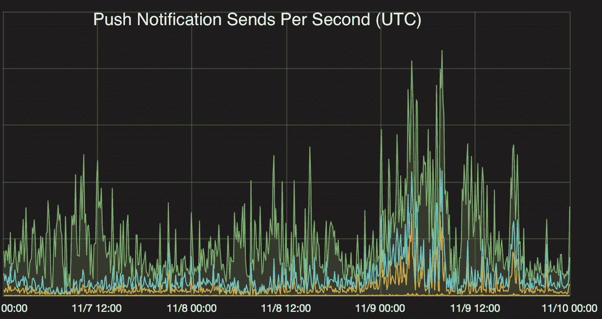
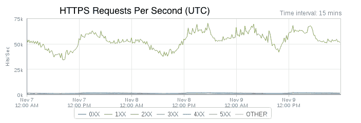
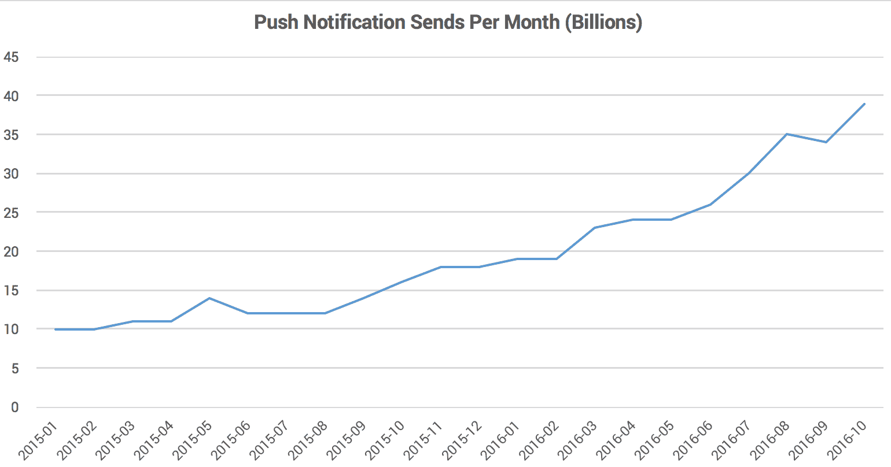
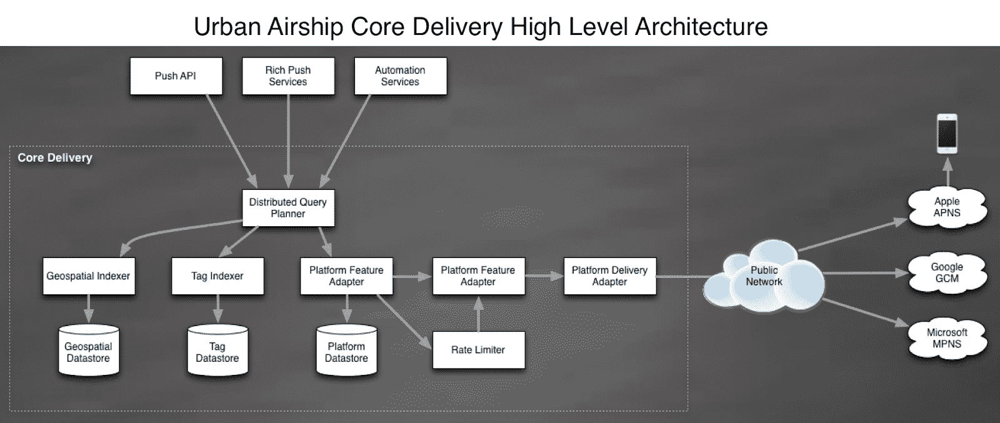

# 美国大选期间城市飞艇如何扩展到 25 亿条通知

> 原文： [http://highscalability.com/blog/2016/11/14/how-urban-airship-scaled-to-25-billion-notifications-during.html](http://highscalability.com/blog/2016/11/14/how-urban-airship-scaled-to-25-billion-notifications-during.html)

*这是 Urban Airship 的来宾帖子。 贡献者：亚当·洛瑞（Adam Lowry），肖恩·莫兰（Sean Moran），迈克·赫里克（Mike Herrick），丽莎·奥尔（Lisa Orr），托德·约翰逊（Christine Ciandrini），阿什什·沃蒂（Ashish Warty），尼克·阿德雷德（Nick Adlard），梅勒·萨克斯·巴尼特（Mele Sax-Barnett），尼尔·凯利（Niall Kelly），格雷厄姆·福里斯特（Graham Forest）和加文·麦奎兰*

Urban Airship 受到数以千计希望通过移动技术发展的企业的信任。 Urban Airship 是一家成立 7 年的 SaaS 公司，拥有免费增值业务模式，因此您可以免费试用 。 有关更多信息，请访问 [www.urbanairship.com](http://www.urbanairship.com/) 。 目前，城市飞艇平均每天发送的推送通知超过 10 亿条。 这篇文章重点介绍了 2016 年美国大选的城市飞艇通知使用情况，探讨了系统的架构-核心传递管道-为新闻发布者提供数十亿次实时通知。

## 2016 年美国大选

在选举日前后的 24 小时内，Urban Airship 发出了 25 亿条通知，这是有史以来的最高日发送量。 这相当于在美国每人 8 条通知，或者世界上每部活动的智能手机 1 条通知。 虽然 Urban Airship 在每个行业垂直领域为超过 45,000 个应用程序提供支持，但对选举使用情况数据的分析显示，超过 400 种媒体应用程序占了这一记录量的 60％，随着跟踪选举结果并在一天之内发送 15 亿条通知 报告。

 

总统选举结束时，通知量稳定并达到顶峰。

到城市飞艇的 HTTPS 入口流量 [API](http://docs.urbanairship.com/api/ua.html) 在选举期间达到了每秒近 75,000 的峰值。 这些流量大部分来自城市飞艇 [SDK](http://docs.urbanairship.com/dev-resources.html) 与城市飞艇 [API](http://docs.urbanairship.com/api/ua.html) [ 。

推送通知量一直在迅速增加。 最近的主要推动力是英国退欧，奥运会和美国大选。 2016 年 10 月，每月通知量同比增长 150％。

## 核心交付管道架构概述

核心交付管道（CDP）是城市飞艇系统，负责从观众选择器中实现设备地址，并传递通知。 无论我们同时发送给数千万用户，针对多个复杂的子细分受众群，包含个性化内容或介于两者之间的任何内容，我们发送的所有通知都期望低延迟。 这是我们的架构的概述，以及我们在此过程中学到的一些知识。

### 我们是如何开始的

最初从 2009 年开始是一个 Web 应用程序，当时有些工人已经转变为面向服务的体系结构。 随着旧系统的各个部分开始遇到规模问题，我们将它们提取到了一个或多个新服务中，这些服务旨在满足相同的功能集，但规模更大且性能更好。 我们许多原始的 [API](http://docs.urbanairship.com/api/ua.html) API 和工作人员都是用 Python 编写的，然后将它们提取到高并发 Java 服务中。 在最初将设备数据存储在一组 Postgres 分片中的地方，我们的规模迅速超过了添加新分片的能力，因此我们转向使用 HBase 和 Cassandra 的多数据库体系结构。

CDP 是处理分段和推送通知传递的服务的集合。 这些服务根据请求提供相同类型的数据，但是出于性能原因，每个服务都以非常不同的方式对数据进行索引。 例如，我们有一个系统负责处理广播消息，向注册到相关应用程序的每个设备传递相同的通知有效负载。 该服务及其底层数据存储区的设计与我们负责根据位置或用户个人资料属性传递通知的服务的设计有很大不同。

我们将任何长期存在的进程视为一项服务。 这些长期存在的过程遵循有关度量，配置和日志记录的通用模板，以简化部署和操作。 通常，我们的服务属于以下两类之一：RPC 服务或使用者服务。 RPC 服务使用非常类似于 GRPC 的内部库提供命令来与服务进行同步交互，而消费者服务则处理来自 Kafka 流的消息，并对这些消息执行特定于服务的操作。

### 数据库

为了满足我们的性能和规模要求，我们严重依赖 HBase 和 Cassandra 来满足我们的数据存储需求。 尽管 HBase 和 Cassandra 都是列式 NoSQL 存储，但它们的取舍却大不相同，这些折衷影响我们使用哪个存储以及用于什么目的。

HBase 非常适合高通量扫描，响应的预期基数很高，而 Cassandra 非常适合低基数查找，其中响应仅包含少量结果。 两者都允许大量的写入吞吐量，这是我们的要求，因为来自用户手机的所有元数据更新都是实时应用的。

它们的故障特性也不同。 在发生故障时，HBase 支持一致性和分区容忍度，而 Cassandra 则支持可用性和分区容忍度。 每个 CDP 服务都有一个非常特定的用例，因此具有高度专业化的架构，旨在促进所需的访问模式并限制存储空间。 通常，每个数据库仅由单个服务访问，该服务负责通过不太专门的界面提供对其他服务的数据库访问。

加强服务与其支持数据库之间的 1：1 关系具有许多好处。

*   通过将服务的支持数据存储视为实现细节而不是共享资源，我们可以获得灵活性。

*   我们可以在不更改服务代码的情况下调整服务的数据模型。

*   使用情况跟踪更为直接，这使容量规划更加容易。

*   故障排除更加容易。 有时服务代码存在问题，而其他时候则是备份数据库问题。 将服务和数据库作为逻辑单元可以极大地简化故障排除过程。 我们不必怀疑“还有谁可以访问该数据库以使其表现为这种方式？” 相反，我们可以依靠服务本身的应用程序级指标，而只担心一组访问模式。

*   因为只有一种服务与数据库交互，所以我们几乎可以执行所有维护活动，而无需停机。 繁重的维护任务成为服务级别的问题：可以在不中断服务的情况下完成数据修复，模式迁移，甚至切换到完全不同的数据库。

的确，在将应用程序拆分为较小的服务时，可能需要进行一些性能折衷。 但是，我们发现，在满足高可伸缩性和高可用性要求方面获得的灵活性远远超过了其价值。

### 数据建模

我们的大多数服务都处理相同的数据，只是格式不同。 一切都必须保持一致。 为了使所有这些服务的数据保持最新，我们严重依赖 Kafka。 Kafka 非常快，也很耐用。 速度需要权衡。 仅保证 Kafka 邮件至少发送一次 ，并且不能保证依次发送。

我们如何处理？ 我们已将所有变异路径建模为可交换的：可以以任何顺序应用操作并最终得到相同的结果。 它们也是幂等的。 这有一个很好的副作用，我们可以重放 Kafka 流以进行一次性数据修复作业，回填甚至迁移。

为此，我们利用了 HBase 和 Cassandra 中都存在的“单元版本”的概念。 通常，这是一个时间戳，但可以是您想要的任何数字（有一些例外；例如，MAX_LONG 可能会导致一些奇怪的行为，具体取决于您的 HBase 或 Cassandra 的版本以及架构如何处理删除）。

对我们来说，这些单元格的一般规则是它们可以具有多个版本，而我们订购版本的方式则取决于它们提供的时间戳。 考虑到这种行为，我们可以将传入的消息分解为一组特定的列，然后将该布局与自定义应用程序逻辑结合起来进行逻辑删除，同时考虑时间戳。 这样可以在保持数据完整性的同时盲写基础数据存储。

仅仅盲目地将更改写入 Cassandra 和 HBase 并非没有问题。 一个很好的例子是在重放事件中重复写入相同数据的情况。 尽管由于我们努力使记录成为幂等，数据的状态不会改变，但必须压缩重复的数据。 在最极端的情况下，这些额外的记录可能会导致大量的压缩延迟和备份。 由于这个细节，我们密切监视压缩时间和队列深度，因为在 Cassandra 和 HBase 中落后于压缩会导致严重的问题。

通过确保流中的消息遵循一组严格的规则，并设计使用服务以预期乱序和重复的消息，我们可以使大量不同的服务仅与一两秒钟保持同步 滞后的更新。

### 服务设计

我们的大多数服务都是用 Java 编写的，但是使用的是一种自以为是的现代风格。 在设计 Java 服务时，我们要考虑一组通用准则：

*   **做一件事，做好它。** -设计服务时，它应该承担单一责任。 实施者可以决定职责中包括的内容，但是她或他将需要准备在代码审查情况下证明其合理性。

*   **没有共享的操作状态** -设计服务时，假定将始终至少有三个实例在运行。 服务需要能够在没有任何外部协调的情况下处理任何其他实例可以处理的相同确切请求。 那些熟悉 Kafka 的人会注意到，Kafka 使用者在外部协调对 topic：group 对的分区所有权。 本指南涉及特定于服务的外部协调，而不是利用可能在幕后进行外部协调的库或客户端。

*   **约束您的队列** -我们在所有服务中使用队列，它们是将请求分批并将其散布到最终将完成任务的工作人员的好方法 从外部阻止。 所有队列都应有界。 边界队列确实引发了许多问题，但是：

    *   当队列已满时，生产者会怎样？ 他们应该阻止吗？ 除？ 下降？

    *   我的队列应该有多大？ 要回答此问题，有助于假设队列始终已满。

    *   如何完全关闭？

    *   根据确切的用例，每个服务将针对这些问题提供不同的答案。

*   **命名自定义线程池并注册 UncaughtExceptionHandler** -如果最终创建自己的线程池，则使用 [的构造函数或帮助器方法 ]执行器](https://docs.oracle.com/javase/8/docs/api/java/util/concurrent/Executors.html) ，以便我们提供 ThreadFactory。 使用该 ThreadFactory，我们可以正确地命名线程，设置线程的守护进程状态，并注册 [UncaughtExceptionHandler](https://docs.oracle.com/javase/8/docs/api/java/lang/Thread.html#setUncaughtExceptionHandler-java.lang.Thread.UncaughtExceptionHandler-) 以处理将异常置于顶部的情况 堆栈。 这些步骤使调试我们的服务变得更加容易，并且使我们避免了深夜的挫败感。

*   **优先于可变状态而不是可变状态** -在高度并发的环境中，可变状态可能很危险。 通常，我们使用可以在内部子系统和队列之间传递的不可变数据对象。 拥有不变对象是子系统之间通信的主要形式，这使得并发使用的设计更加简单，并且使故障排除更加容易。

## 我们从这里去哪里？

凭借 Urban Airship 通过移动钱包通行证发送通知的功能，对 Web 通知和 Apple News 通知的新支持以及其将通知发送到任何平台，设备或营销渠道的开放渠道功能，我们预计通知量将成倍增长 。 为了满足这一需求，我们将继续在“核心交付管道”架构，服务，数据库和基础架构上进行大量投资。 要了解有关我们技术的更多信息以及前进的方向，请参阅 [GitHub](https://github.com/urbanairship) ， [开发人员资源](http://docs.urbanairship.com/dev-resources.html) ， [文档](http://docs.urbanairship.com/index.html) 和我们的 [职位页面](https://www.urbanairship.com/careers) 。