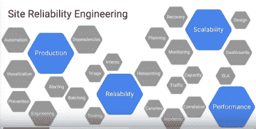

# Google 如何针对行星级基础设施进行行星级工程设计？

> 原文： [http://highscalability.com/blog/2016/7/18/how-does-google-do-planet-scale-engineering-for-a-planet-sca.html](http://highscalability.com/blog/2016/7/18/how-does-google-do-planet-scale-engineering-for-a-planet-sca.html)

Google 如何保持其所有服务正常运行？ 他们似乎从来没有失败过。 如果您想知道我们在 [GCP NEXT 2016](https://cloudplatformonline.com/next2016-schedule.html) 上发表的演讲中的精彩幕后花絮， [Melissa Binde](https://www.linkedin.com/in/mbinde) ，Google Storage SRE 总监： [Google 如何针对行星级基础架构](https://www.youtube.com/watch?v=H4vMcD7zKM0)进行行星级工程。

梅利莎（Melissa）的讲话很简短，但充满智慧，而且以一种胡说八道的方式表达出来，使您认为服务是否失败梅利莎（Melissa）绝对是您想要的那种人。

哦，什么是 SRE？ 它代表*站点可靠性工程*，但定义更难以理解。 就像您要求道的定义时得到的答案一样。 正如 Google 的本·斯洛斯（Ben Sloss）24x7 副总裁所明确指出的那样，这不仅仅是一个过程，更是一个过程，他将 SRE 定义为：

> 当软件工程师承担了过去称为操作的任务时会发生什么。

让它在您的头部反弹一会儿。

最重要的是，有一件事很清楚：SRE 是生产的保管人。 SRE 是 google.com 和 GCP 的客户体验的托管人。

对我来说，一些演讲重点：

*   **点检正常运行时间的破坏性激励与功能**相比。 SRE 试图解决想要推送功能的开发人员与想要通过不推送功能来维持正常运行时间的系统管理员之间的天然紧张关系。
*   **错误预算**。 这就是预期会失败的想法。 这不是一件坏事。 用户无法确定服务的运行时间是 100％还是 99.99％，因此您可能会出错。 这减少了开发人员和运营人员之间的紧张关系。 只要维持错误预算，您就可以推出新功能，而运营方也不会受到指责。
*   **目标是立即恢复服务。 故障排除将在稍后进行。** 这意味着在恢复服务后，您需要大量日志记录和工具来进行调试。 由于某种原因，这使[较早的文章](http://highscalability.com/blog/2014/2/3/how-google-backs-up-the-internet-along-with-exabytes-of-othe.html)上的内容闪烁了起来，同样基于 Google SRE 的讲话：*备份无用。 这是您关心的*还原。
*   **没有无聊的分页哲学**。 当页面进入时，应该是一个有趣的新问题。 您不希望无聊的 SRE 处理重复性问题。 这就是机器人的目的。

演讲中其他有趣的话题是：SRE 的组织结构如何？ 如何聘请开发人员担任侧重于生产的角色并使他们满意？ 我们如何保持团队在 Google 内部的价值？ 我们如何帮助我们的团队更好地沟通并解决与数据而非断言或权力夺取的分歧？

让我们继续吧。 以下是 Google 如何针对行星级基础设施进行行星级工程...

## 保持平衡：点检正常运行时间的破坏性动机与功能

*   系统管理员会在站点正常运行时获得 Cookie 的正常运行时间。 当网站停滞不前时，我们会吸引访问者，访问者会给我们钱。

*   开发人员会获得功能的 Cookie。 发布一个新功能，访问者来了，他们给了我们钱。

*   生产冻结，也就是新功能的冻结，通常映射为增加正常运行时间。

*   开发人员和系统管理员之间存在天生的紧张关系。 开发人员会获得发布功能的 Cookie。 系统管理员会获取 Cookie 以确保正常运行时间。

*   因此，系统管理员因阻止新功能发布而获得奖励。 如果开发人员能够解决系统管理员的问题，他们将获得奖励。

*   开发人员进行他们所谓的 Beta 测试是为了尽快发布功能。

*   系统管理员执行他们所谓的启动审核，以减慢新功能。

*   您的团队将所有的时间都花在彼此抗争上，因此您会增加停机次数，风险，混乱和无政府状态。

*   您想要的是消除异想天开的命令。 请按规则处理，以便团队可以有目标并共同努力。

*   与 devops 一样，有一种方法可以使开发人员和操作人员一起工作。 问题是，devops 无论走到哪里都有不同的含义。 相反，SRE（站点可靠性工程）定义明确。

*   **SRE：** **当您要求软件工程师设计和运行操作时会发生什么情况**-Ben Sloss 24x7 VP，Google

    *   软件工程师-事实证明，当知道软件的人也运行服务时，服务可以更好地运行。 他们对什么使它打勾有深刻的理解。

    *   设计和运行-实际上是设计您的生产环境，而不是让它成为意外的事故。

*   假设有 1000 个 SRE 在 Google 的基础架构上工作：网络，计算，存储等。有多少个 SRE 负责云计算？

    *   所有。

    *   google.com 和 GCP（HTG1）的运行之间没有界限。 不需要让云团队和内部团队进行沟通的开销。 他们创造了一种环境，可以帮助所有人协同工作。

## 技能：SRE 是一个印章团队和圣职

*   本节的标题是我的描述。 具有技能的 SRE 必须是精英。 在工作方面，他们仅致力于这种几乎准神秘的事物，称为生产。

*   SRE 必须比开发人员更熟练，才能完成相同的工作：

    *   他们需要更大的技能范围。

    *   所有 SRE 必须通过完整的软件开发人员面试才能被录用。

    *   所有 SRE 必须通过一次非抽象的大型系统设计采访。

*   SRE 必须具有相同的软件技能，这是不同的应用领域。

    *   开发人员专心于产品经理并制作功能。

    *   SRE 依赖于生产，以使生产达到最佳状态。

*   **当将面向开发和面向生产的观点结合在一起时，最终的设计会更强大**。

*   入职流程示例给出了 SRE 带来的一个示例，该过程在将团队的项目置于 SRE 的责任之下时发生。 在评估团队的软件时，他们发现：

    *   当达到规模时，它将在生产中失败。

    *   开发人员已隐式假定某种呼叫不会失败。

    *   他们假设请求的分配是均匀的。

    *   他们以为不会受到用户的关注。

    *   他们假定所有请求的大小均处于平均水平。

    *   他们在两条尾巴上失败了（没有给出解释）。

## 组织：为开发人员提供不让运营工作积聚的理由

*   该系统必须设计为不增加运营工作，因为如果开发人员不从事工作，他们将不会那么在意。

*   **SRE** 的开发预算。 如果您的系统的运营开销很大，那么您获得的开发人员就不会那么多，那么您就无法推广那么多的功能。

*   SRE 具有完全不同的命令链。 他们有自己的副总裁，与开发副总裁分开。 这赋予了他们权力和权力。 当生产意味着他们需要拒绝时，它允许他们说不。 一堆不是的传呼猴子。

*   当开发人员说他们可以捐赠人数时，SRE 不必接受。 SRE 可以说服务不够重要，请自己继续提供支持。

*   SRE 是一种稀缺资源。 并非 Google 的每个团队都有 SRE。 云确实可以，但是不是每个其他团队，甚至不是云中的每个小服务，都只是重要的。

## 环境：如何使开发人员在生产团队中保持快乐？

*   **至少有 50％的工作需要为项目工作**。 不待命。 不是门票。 不开会。 实际上是在做项目工作。

*   如果项目工作量过多，则开发人员会为 SRE 分配更多的人员，或者将额外的工作流转给开发人员团队。

*   什么是项目工作？

    *   通过切换基础数据库技术来改善服务的延迟。

    *   编写自动化以加速部署。

    *   跨服务的项目。 Google 作为一项内部服务，可以由其他服务（通常由软件 bot）在内部进行查询，如果可以安全地将计算机停机，可以安全地将机架停机或者将数据中心安全地停机，则可以返回 Google ？

*   SRE 是一支志愿军。 没有草稿。

    *   您可以随时转入另一个 SRE 团队。

    *   您可以随时转换为 dev。

    *   Mission Control 是一个程序，开发人员可以在其中试用 SRE 并查看他们是否喜欢它。

*   团队很流畅。 人们来自团队，分享经验，分享观点。

## 预算：您可以支出任意预算的错误预算

*   如果您有 3 个 9 的可用性，目标是不将其提高到 4 个 9，那么您的错误预算为.1％。

*   **如果您想更快地推出功能并使 GCP 变得更好，那就去做吧。 直到用尽错误预算。**

*   如果您希望进行较差的测试，使软件定期出现故障并且必须不断回滚，那么您也可以选择该选项，但是错误预算很快就会用光，并且您将无法启动 。

*   错误预算按季度循环。

*   有一个逃生阀：三枚银子弹。

    *   一个开发人员可以说我真的需要推动，请给我一个银弹。

    *   SRE 会说“ OK”，但您必须说服 VP 您实际需要推动。

    *   这个仪式听起来很愚蠢，但功能非常强大。 它将控制权交给开发人员。 他们有 3 个灵丹妙药，由他们的副总裁来决定是否合适。

*   错误预算基于每个服务。 因此，如果多个开发团队使用相同的服务，则它们共享相同的预算。

    *   SRE 不在交战的开发团队中间。 他们必须弄清楚如何花费错误预算。

*   机外。 如果所有其他方法都失败了，并且开发人员和 SRE 确实不同意，则 SRE 可以派遣开发团队。

    *   像和睦的离婚。

    *   这是至关重要的逃生阀门，因此团队在很长一段时间内都不会出现令人讨厌的分歧。

    *   很少见，但确实发生了。 一个示例场景是，如果团队不想在其 ACID 类型项目中使用 Spanner，如果开发团队说他们想建立自己的团队，那么 SRE 团队可以说他们不想为团队提供支持。 去建立自己的数据库，因为这对生产不利。

*   SRE 是 google.com 和 GCP 的生产托管人，SRE 是客户体验的托管人。

## SRE 支持在频谱上

*   聊天和咨询。 与开发人员聊天。 进行白板会议。

*   协同设计。 与开发人员一起创建设计。

*   完全所有权。 完全拥有的服务。 所有容量，所有供应，所有页面。

*   页面是保持诚实的一种方式。 它们不是 SRE 的目的。

    *   负责制作的人应该抓这些页面，因为这样可以使他们的皮肤保持游戏中的外观。

    *   它还有助于使 SRE 的技能，专长和观点保持最新。

## 是什么让事情顺利进行？ 文化和过程

*   Google 会进行常规的培训和通话阴影处理。

*   Google 也有一个名为：**不幸轮盘**的过程-卷轴游戏。

    *   一个人是地牢大师，他们有一个受害者，团队轮流尝试猜测发生了什么。

    *   Google 运行非常复杂的系统。 除了进行培训的人之外，很少有人真正知道发生了什么以及答案是什么。

    *   这对新的来电者很有用。 让他们在受控环境中进行测试。

    *   一些团队在某些场景中会破坏生产并让新手对其进行修复。

    *   对退伍军人也有好处。 最好重新整理您的知识，尤其是在使用非常复杂的系统时。

## 事件管理

*   场景：您正在呼叫 gmail，并且您获得了一张票证，用户可以看到其他用户的电子邮件。 你是做什么？ 关闭 gmail。

*   **Oncallers 被完全授权采取一切措施来保护用户，保护信息，保护 Google。** 如果这意味着要关闭 gmail 甚至关闭所有 google.com，那么作为 SRE，您的副总裁将为您提供支持，而您的 SVP 将为保护 Google 提供支持。

*   **目标是立即恢复服务。 故障排除将在稍后进行。**

    *   有二进制状态的记录。 有日志。

    *   醒着，开发人员在办公室，所有人都在时，请进行故障排除。 目的是使服务重新启动并运行。

## 你该怪谁？

*   当“新开发者”推送代码并破坏 google.com 达三个小时时，您应该对谁负责？ a）新开发者 b）代码审查。 c）缺乏测试（或被忽略）的测试。 d）缺乏针对代码的适当的金丝雀程序。 e）缺乏快速回滚工具。

    *   除了新开发者以外的所有东西。 **如果新开发人员编写的代码会导致该网站瘫痪，那不是开发人员的错。 这是开发人员和工作人员之间所有关口的错。**

    *   **绝对不允许人为错误传播到人外。** 查看允许部署损坏的代码的过程。

## 无罪的岗位形态

*   避免责备文化至关重要。

*   研究表明，大多数事件是人为错误引起的。

*   **最好通过了解实际发生的事件来解决事件。** 不知道发生了什么的最好方法？ 通过寻找责任人来揭开每一个事件。

*   人们真的很擅长隐藏，并确保没有线索，并确保您实际上不知道发生了什么。 试图怪罪只会使您的工作更加困难。

*   在 Google 谁搞砸了谁写的事后验尸。 这样可以避免命名和遮挡。 使他们有能力纠正错误。 促成失败的每个人都应尽可能诚实地参与进来，并写下您如何陷入困境。

*   已在全体会议上给予拆除该站点的奖金，因为他们立即拥有该站点，因此他们拥有了该站点。 他们上了 IRC，并将其回滚。 他们说出来并如此迅速地照顾好他们，便获得了奖金。

*   无赖并不意味着没有名称和细节。 这意味着我们不会因为事情出错的原因而选择别人。 不应发生诸如断电之类的事情，应予以解雇。

*   深度防御

    *   由于策略是纵深防御，因此事后评估模板将操作分为预防，检测和缓解措施。

    *   **我们希望防止中断，我们希望更快地检测到它们，并希望减轻影响。**

    *   如果类似的情况再次发生，它将不会传播到很远，持续太久或影响那么多的客户。

## 分页的无聊哲学

*   团队喜欢看什么样的页面？ 新的和有趣的。

*   您知道如何解决的页面很无聊。 您应该创建一个机器人来解决该问题。

*   Google 发明了许多机器人。 他们不喜欢无聊。

*   如果您可以写下修复它的步骤，那么您可能可以编写自动化来修复它。

*   不要做机器人可以为您做的事情。

*   构建漫游器的结果是，理想情况下，每个页面都是全新的，因此不会感到无聊。 甚至经验丰富的工程师也可能在每次寻呼机关闭时都看到一些新内容。

*   **这是哲学的根本变化。 如果一切正常，重复的事件很少，则意味着您在调试系统时不会像以前那样沉迷于此。**

## 需要更强大的调试工具

*   **如果所有问题都是新问题，则意味着您需要更强大的调试工具来查找问题。**

*   文本日志不是调试工具。 如果您不知道要查找的内容，则无法在日志文件中查找模式的标准调试无法进行。 使用 GCP 大小的平台，您需要浏览多少个外观才能找到失败的外观？

*   Google 严重依赖于各种可视化工具来解决不熟悉的问题并尽快恢复服务。

*   绘图工具：石墨，InfluxDB + Grafana，OpenTSDB。

    *   这些和其他提到的工具不是 Google 使用的工具，因此不建议使用，但它们是有用工具的开放源代码示例。

    *   很高兴看到正在发生的一切。 Google 拥有数十亿亿个流程，因此您需要汇总视图才能理解事物。

    *   **Google 在其二进制文件中放置了很多工具。** 在新情况下，您并不总是知道您要寻找的东西。

*   创建一个框架，使开发人员可以轻松地插入监视框架。

*   大量存储空间专门用于存储监视数据。

    *   **的想法是，您不想在中断期间进行故障排除。 中断仅与恢复服务有关。**

    *   故障排除是您稍后醒来时要执行的操作。 开发人员经常参与故障排除过程，因为他们对系统有更深入的了解。

    *   历史数据必须可用，以便故障恢复后可以进行故障排除。 恢复不会导致中断监视数据丢失。

    *   这种方法可以使停机时间尽可能短，同时可以在以后解决问题。

*   事件绘图-对于关联事件非常有用。

    *   充分利用人类的模式匹配能力，很难编写机器人来做到这一点。

    *   给出了一个图表示例，其中每行是一个数据中心，列是时间，单元格中的颜色是事件类型。

    *   这可以帮助您找到不是单个事件的模式，例如导致级联故障的软件推出，或者一起重复出现的错误簇，或者如果您看到延迟尖峰之后立即出现错误尖峰 重复一遍。 这些都将有助于确定问题的根本原因。

*   可视化过程跟踪-有时您需要深入到过程级别以识别性能问题。

    *   开源选项不多：Performance Co-Pilot + vector。

    *   Google 有一个非常复杂的框架，可将示例查询拉入存储并提供完整的跟踪记录。

    *   可视化工具的优点是很难理解时间戳。 可视化工具使您可以更轻松地折叠，展开和比较事件。

*   网络流量和容量

    *   开源选项：仙人掌，天文台和 Nagios

    *   事实证明，很多存储缓慢的问题实际上是网络问题。

    *   如果您正在查看存储系统，但无法弄清为什么它对网络的访问速度很慢。

    *   您需要一个工具来快速查看网络状态。 哪些链接超载？ 您看到多少个包错误？ 链接断开了吗？

*   日志文件-当所有其他失败时

    *   开源：ElasticSearch + Logstash（+ Kibana）

    *   您不想遍历日志文件。 您需要一个具有更多类似查询的 SQL 的系统，以便您可以挖掘日志。

    *   日志应易于使用且易于理解。

## Stackdriver 错误报告

*   如果您想看看 SRE 所拥有的那种工具的例子，那么请看 [Google Stackdriver 错误报告](https://cloud.google.com/error-reporting/) 。

    *   这是他们能够用于服务的内部工具。

    *   通过分析堆栈跟踪将分组错误并进行重复数据删除

    *   系统了解所使用的通用框架并相应地对错误进行分组。

*   该计划将做更多。 Google 内部拥有广泛的工具，他们希望向云客户提供这些工具。

## 相关文章 [

*   [在 HackerNews](https://news.ycombinator.com/item?id=12116121) 上/ [在 Reddit](https://www.reddit.com/r/programming/comments/4tg31p/how_does_google_do_planetscale_engineering_for_a/) 上
*   图书：[网站可靠性工程：Google 如何运行生产系统](https://www.amazon.com/Site-Reliability-Engineering-Production-Systems-ebook/dp/B01DCPXKZ6)。 它是由从事实际 SRE 工作的实际 Google SRE 编写的，是作者 500 年综合经验的结果。
*   [大规模计算，或者说 Google 如何扭曲我的大脑](http://matt-welsh.blogspot.com/2010/10/computing-at-scale-or-how-google-has.html)
*   [网站可靠性工程师-使 Google 保持 24/7 全天候运行](http://transcriptvids.com/v2/yXI7r0_J29M.html)
*   [服务水平和错误预算](https://www.usenix.org/conference/srecon16/program/presentation/jones)
*   [SREcon](https://www.usenix.org/conference/srecon16) 。 会议视频[可用](https://www.usenix.org/conference/srecon16/program)。 看起来内容很多。
*   [小组：谁/什么是 SRE？](https://www.usenix.org/conference/srecon16/program/presentation/definition-of-sre-panel)
*   [策略：规划停电的 Google 样式](http://highscalability.com/blog/2010/3/5/strategy-planning-for-a-power-outage-google-style.html)
*   [Google 如何备份互联网以及 EB 级其他数据](http://highscalability.com/blog/2014/2/3/how-google-backs-up-the-internet-along-with-exabytes-of-othe.html)
*   [什么是“网站可靠性工程”？](https://landing.google.com/sre/interview/ben-treynor.html)
*   [成为 Google 的网站可靠性工程师（SRE）感觉如何？](https://www.quora.com/What-is-it-like-to-be-a-Site-Reliability-Engineer-SRE-at-Google)
*   [我的警惕](https://docs.google.com/document/d/199PqyG3UsyXlwieHaqbGiWVa8eMWi8zzAn0YfcApr8Q/preview#)的哲学，作者：Rob Ewaschuk，Google SRE
*   [这是 Google 确保（几乎）永不衰败的方式](http://www.wired.com/2016/04/google-ensures-services-almost-never-go/)

FWIW，Stack Driver 并不是他们能够用于服务的内部工具； 这是 Google 购买的 SaaS 创业公司。

https://techcrunch.com/2014/05/07/google-acquires-cloud-monitoring-service-stackdriver/