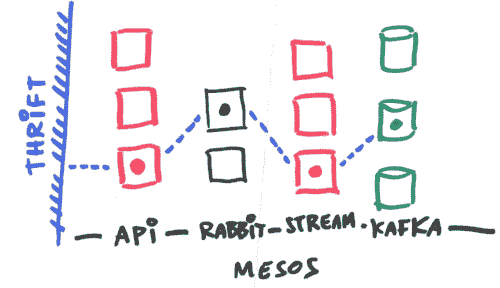

# Autodesk 如何在 Mesos 上实施可扩展事件

> 原文： [http://highscalability.com/blog/2015/8/17/how-autodesk-implemented-scalable-eventing-over-mesos.html](http://highscalability.com/blog/2015/8/17/how-autodesk-implemented-scalable-eventing-over-mesos.html)

*这是 [Autodesk](http://www.autodesk.com/) Cloud 的软件架构师 [Olivier Paugam](https://www.linkedin.com/pub/olivier-paugam/2/214/475) 的来宾帖子。 我真的很喜欢这篇文章，因为它显示了如何将基础架构（Mesos，Kafka，RabbitMQ，Akka，Splunk，Librato，EC2-）组合在一起以解决实际问题。 如今，一个小团队可以完成多少工作，真是令人惊讶。*

几个月前，我受命提出一个*中央事件系统*，该系统可以使我们的各种后端相互通信。 我们正在谈论活动流后端，渲染，数据转换，BIM，身份，日志报告，分析等。 而且，我们的工程团队也可以轻松地进行交互。 当然，系统的每个部分都应能够*自行扩展。*

我显然没有时间写太多代码，而是选择 [Kafka](http://kafka.apache.org/) 作为我们的存储核心，因为它稳定，广泛使用并且可以正常工作（请注意，我并不一定要使用它，并且可以切换 到别的东西）。 现在，我当然不能直接公开它，而必须使用一些 API 对其进行前端处理。 不用多考虑，我也拒绝让后端管理偏移量的想法，因为它对例如处理故障的方式施加了太多约束。

那我最终得到了什么？ 分为两个单独的层：**首先是处理传入流量的 API 层，然后是托管与 Kafka（例如，实现生产者&消费者）交谈的长期的有状态流处理程序**的后端层。 这两层都可以独立扩展，只需要在它们之间进行一致的路由即可确保客户端继续与同一个后端流处理进行对话。

这些层在 **Scala** 中实现了 100％，并使用[播放！ 框架](https://www.playframework.com/)。 他们也严重依赖 **Akka actor 系统**（每个节点通常运行数百个 actor）。 后端层实现了一组自定义的 Kafka 生产者&使用者，并使用一组专用的参与者来管理预读&写缓冲区。 一切都实现为嵌套的有限状态机（我喜欢这个概念）。 分析会转到 **Splunk** ，而指标会转到 **Librato** （*收集的*在容器中运行）。

 *发布外观的艺术渲染。*

那么，如何在两层之间路由？ 只需使用 [RabbitMQ](https://www.rabbitmq.com/) ，它非常耐用&有弹性，就不好笑了。 AMQP 队列是实现此简单“电话切换”模式的好方法。 通过使用将一组固定的后端节点与一个 RabbitMQ 代理相关联的逻辑分片（例如，对每个事务中存在的某些 Cookie 进行哈希处理或类似操作）来进行扩展也是很简单的。

为什么我不对 RabbitMQ 经纪人进行集群？ 好吧，主要是因为我很懒，也因为这并不是必须的。 **在我看来，分摊单个经纪人**中的流量实际上同样有效，而且更易于控制。 与收益相比，要做的额外工作微不足道。

简而言之，给定一些容器拓扑，我们的请求将遵循特定的路径，具体取决于哪个后端节点承载了什么流会话。 **扩展整个过程就像给定您需要的**独立地扩展每个层一样简单。 唯一实际的限制将来自您的虚拟网络适配器以及可以通过多少带宽。

 *虚线显​​示了来自给定会话的路径请求将遵循的路径。*

现在来了有趣的部分：**我们如何保证可靠的流量并避免拜占庭式故障？** Mucho 说的很简单，只需采用简单的两阶段提交式协议，并将客户端和后端建模为镜像状态机（例如，它们始终保持同步）。 这可以通过具有需要显式确认请求的读写操作来实现。 您尝试阅读某些内容，如果失败了，您可以重试，直到您可以放置​​确认，然后更改后端（例如，向前移动 Kafka 偏移量或安排要发布的事件块）为止。 所以我的客户和后端之间的流量实际上就像是“分配会话”，“读取”，“ ack”，“读取”，“ ack” ...“ dispose”。

这种系统的巨大优势在于，**可以有效地使操作成为幂等，**加上**可以在状态机**中对所有逻辑进行编码，而无需任何烦人的声明性语句（ *对我自己：我应该提供一个纯粹的功能实现，以保持冷静*。 当然，任何网络故障都将适当地重试。 顺便说一下，您还可以获得自由的控制流和背压。

因此，整个事情都以 [Apache Thrift](https://thrift.apache.org/) API 的形式公开（目前已通过 HTTPS 进行了压缩，并且计划将其迁移到纯 TCP）。 我拥有 Python，Scala，.NET 和 Ruby 的客户端 SDK，以配合我们在 Autodesk 使用的各种令人眼花 variety 乱的技术。 请注意，Kafka 偏移量由客户端管理（尽管不透明），这使后端更易于控制。

等一下 **如何处理后端节点发生故障的情况？** 多亏了两阶段协议，我们在读取数据时并没有真正遇到问题：客户端反复出现故障，然后使用其当前偏移量重新分配新的流会话。 向 Kafka 写入数据时会担心，因为这是异步的，并且可能会受到下游背压的影响（例如，您的节点发生故障，Kafka 代理也有问题。.urg）。 我为后端节点配备了正常关机功能，它将在等待任何挂起的写操作通过时快速使任何传入请求失败。 最后，我们甚至可以将所有待处理的数据刷新到磁盘（并在以后重新注入）。

再说一遍。 **如果部分基础架构爆炸了怎么办？** 。 您与处理您的流会话的实际后端节点之间的任何流量中断都将使您放慢速度，但当然不会受到任何讨厌的影响，这要归功于两阶段协议。

哦，我忘记添加了**数据，该数据在登陆 Kafka 日志之前会自动加密**（AES 256）。 没有更多的 la 脚的密钥共享尝试使用香草卡夫卡的生产者和消费者进行相同的操作。 在安全性主题上，我可以添加我们的流会话通过 OAUTH2 进行身份验证，使用按请求的 MD5-HMAC 质询并通过 TLS 向下访问后端群集。

那么，您现在要问的是如何部署所有这些时髦的系统？ 好吧，我们在普通的 [Mesos / Marathon](https://github.com/mesosphere/marathon) 集群（目前不是 [DCOS](https://mesosphere.com/) ）上 100％运行它，但我们可以切换到它，并从它们令人敬畏的仪表板中受益。 此时，群集是**托管在 AWS EC2** 上的，我们基本上将整个事物复用到了少数 c3.2xlarge 实例上（对于给定区域的小型部署，10 至 20 个实例就足够了）。 请注意，我们可以在 [Kubernetes](http://kubernetes.io/) （EC2 或 GCE）上执行完全相同的操作。

*有点提醒我们堆栈的结构。*

一切都使用我们的 [Ochopod](https://github.com/autodesk-cloud/ochopod) 技术（自集群容器）进行了部署，该技术也采用开源的方式。 操作减少到绝对最小值。 例如，例如，对 API 层进行适当的构建推送，只需分配一些新容器，等待它们安顿下来然后逐步淘汰旧容器即可。 所有这些都是通过在集群中运行的专用 Jenkins 从属服务器（本身也是 Ochopod 容器）完成的！

我实际上开发了 [Ochothon](https://github.com/autodesk-cloud/ochothon) mini-PaaS，只是为了能够快速开发/运行所有这些容器。

*Ochothon CLI 显示了我的预生产集群之一。*

为了让您了解 Ocho- *平台的全部功能，我只想说**，一个人（我）可以管理 2 个区域（包括所有复制基础设施**）的 5 个系统部署 ……还有时间写博客和编写代码！

因此，总体而言，设计和编码整个过程非常有趣，而且它现在已经在生产中运行，成为我们云基础架构的关键任务部分（这是一个不错的奖励）。 让我们知道，如果您想了解更多有关此异国流媒体系统的信息！

## 相关文章

*   [在 Mesos / Marathon 上部署我们的事件基础架构& Ochothon！](http://cloudengineering.autodesk.com/blog/2015/05/after-a-long-day-of-devops-to-inaugurate-the-latest-ochothon-release-i-though-id-share-quick-what-it-feels-like-deploying-ou.html)
*   [Ochopod + Kubernetes = Ochonetes](http://cloudengineering.autodesk.com/blog/2015/05/ochopod_plus_kubernetes.html)
*   [有限状态机的返回！](http://cloudengineering.autodesk.com/blog/2015/07/fsm.html)

纸上写的很好，但他们的服务影响了现实生活。 看一下 123D Catch，大多数时候您无法将任何数据上传到云中。

我有一个基本问题。 您为什么选择使用 RabbitMQ 与 2 层进行黑白通信？ 这与使用 Kafka 进行交流有何不同？ 从理论上讲，Coz 甚至支持在散列上进行分区，并且也很耐用。

同样，在使用 kafka 的情况下，更多的是流处理的情况。 请指教..