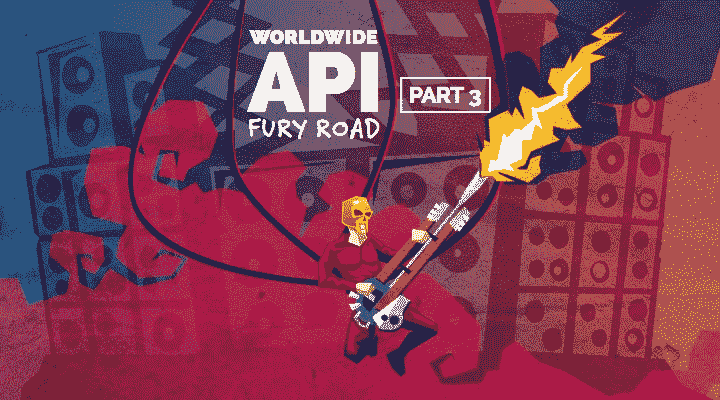

# 阿尔及利亚通往全球 API 第 3 部分的愤怒之路

> 原文： [http://highscalability.com/blog/2015/7/27/algolias-fury-road-to-a-worldwide-api-part-3.html](http://highscalability.com/blog/2015/7/27/algolias-fury-road-to-a-worldwide-api-part-3.html)

我们为开发人员和开发人员回答的最常见问题是关于 [我们的架构](http://highscalability.com/blog/2015/3/9/the-architecture-of-algolias-distributed-search-network.html) 以及我们如何实现如此高的可用性。 他们中的一些人对裸机服务器的高可用性持怀疑态度，而另一些人则对我们如何在全球范围内分发数据持怀疑态度。 但是，我更喜欢的问题是“初创企业如何建立这样的基础架构”。 的确，对于一个年轻的公司，我们当前的架构令人印象深刻：

*   我们的高端专用计算机在全球 13 个地区托管，拥有 25 个数据中心

*   我们的主从设置会在至少 3 台不同的计算机上复制我们的搜索引擎

*   我们每个月处理超过 60 亿个查询

*   我们每个月接收和处理超过 200 亿次写操作

就像罗马不是一天建成的，我们的基础架构也不是很好。 本系列文章将探讨我们在构建基础架构时采取的 15 个工具步骤。 我什至将讨论我们的中断和错误，以便您了解我们如何使用它们来改进我们的体系结构。

此系列的 [第一篇博客文章](http://highscalability.com/blog/2015/7/13/algolias-fury-road-to-a-worldwide-api.html) 专注于我们早期的 Beta 版， [第二篇文章](http://highscalability.com/blog/2015/7/20/algolias-fury-road-to-a-worldwide-api-steps-part-2.html) 在服务的前 18 个月，包括我们的首次停机。 在上一篇文章中，我将描述我们如何将“启动”架构转换为能够满足大型上市公司期望的新事物。

## 步骤 11：2015 年 2 月

### 启动我们的全球同步基础架构

在这个月中，我们实现了自 2014 年 4 月以来一直致力于的愿景，即“向全球扩展以更好地为我们的用户服务”。

该网络由 12 个不同的位置组成：美国东部（弗吉尼亚州），美国西部（加利福尼亚州），澳大利亚，巴西，加拿大，法国，德国，香港，印度，日本，俄罗斯和新加坡。 最重要的是，我们还启动了“分布式搜索”功能。 使用此功能，只需单击几下，您就可以设置网络中应该自动复制数据的位置。 您将使用与以前相同的 API，查询将自动从最终用户的浏览器或移动应用程序路由到最近的位置。

这是减少最终用户延迟并通过全球搜索分布提高我们的高可用性的重要一步。 由于互联网链接的距离和饱和度，从一个位置为国际用户提供服务会导致非常不同的服务质量。 现在，我们为用户提供了解决该问题的方法！ 除了减少延迟之外，这还提高了我们搜索基础架构的高可用性，因为它不再依赖于单个位置。 遍布全球！

有些人将我们的 DSN（分布式搜索网络）与 CDN（内容交付网络）进行了比较，但这是非常不同的。 我们不会在每个边缘存储您经常查询的缓存。 我们存储您所有数据的完整副本。 我们可以从边缘位置本身响应任何查询，而不仅仅是最流行的查询。 这意味着，当您选择三个 POP（美国东部，德国，新加坡）时，欧洲的用户将前往德国，亚洲的用户将前往新加坡，美国的用户将前往美国东部。 所有 POP 都将响应查询，而不必与其他边缘进行通信。 这在用户体验和高可用性方面产生了巨大的差异。

为了支持此更改，我们更新了 API 客户端中的重试逻辑，以首先定位 [APPID-dsn.algolia.net](http://appid-dsn.algolia.net) 主机名， 使用基于 geoip 的 DNS 将其路由到最近的位置。 如果最接近的主机关闭，则更新 DNS 记录以在不到一分钟的时间内删除该主机，以便返回下一个最接近的主机。 这就是为什么我们在每条记录上使用 1 分钟的低 TTL 的原因。 如果发生故障，如果主机关闭并且 DNS 尚未更新，我们将通过 [APPID-1.algolia.net](http://appid-1.algolia.net) 上的重试将流量重定向到主区域。 ， [APPID-2.algolia.net](http://appid-2.algolia.net) 和 [APPID-3.algolia.net [ 我们的官方 API 客户端中的](http://appid-3.algolia.net) 。 这种方法是我们在高性能和高可用性之间找到的最佳平衡，万一发生故障，我们只会在一分钟内降低性能，但 API 仍可以运行&！

## 步骤 12：201 年 3 月

### 每个位置的更高可用性

分布式搜索网络选项可改变游戏规则，以实现高可用性，但仅适用于搜索用户和国际用户。 为了提高主要区域的高可用性，我们在两个完全独立的提供商中分布了我们的美国集群：

*   两个不同位置的数据中心（例如：Manassas 中的 COPT-6 & Ashburn 中的 Equinix DC-5：彼此之间 24 英里，延迟为 1ms）

*   三台不同的计算机-就像以前一样（两台在不同可用性区域中的第一个数据中心，另一台在第二个数据中心中的）

*   两个不同的自治系统（所以两个完全不同的网络提供商）

这些更改提高了我们对遇到的某些问题（例如提供商和 AWS 之间的对等链接的饱和）做出反应的能力。 拥有不同的提供商可以使我们选择将流量重新路由到其他提供商。 就提高一个位置的高可用性而言，这是一大进步。

## 步骤 13：2015 年 4 月

### 随机文件损坏头痛

对于我们的制作团队来说，2015 年 4 月是一个黑色的月份。 由于某些 SSD 的 TRIM 实现中存在错误，我们开始观察生产机器上的随机文件损坏。 您可以在 [此博客文章](https://blog.algolia.com/when-solid-state-drives-are-not-that-solid/) 中详细阅读该问题。 我们花了大约一个月的时间来跟踪问题并正确识别。 在这段时间里，我们怀疑一切，从我们自己的软件开始！ 这也是对我们的体系结构的重大考验。 在磁盘上随机破坏文件不是一件容易的事。 通知我们的用户由于磁盘已损坏而需要重新索引其数据也不容易。 幸运的是，我们从未丢失任何客户数据。

我们的架构中有两个重要因素使我们能够面对这种情况而不会丢失任何数据：

*   我们存储了三个数据副本。 在三台计算机上随机破坏相同数据的可能性几乎为零（并且没有发生）。

*   更重要的是，我们没有复制索引结果。 相反，我们复制了从用户那里收到的操作，并将其应用于每台计算机。 由于一台受影响的机器无法“污染”另一台机器，因此这种设计使几台机器具有相同损坏的可能性非常低。

设计架构时，我们从未考虑过这种情况！ 即使我们试图考虑所有类型的网络和硬件故障，我们也从未想象过内核错误甚至固件错误的后果。 我们的设计要有独立的机器，这是我们能够最小化问题影响的原因。 对于任何需要高可用性的系统，我强烈建议这种独立性。

## 步骤 14：2015 年 5 月

### 引入了多个 DNS 提供商

由于 NSONE 出色的 DNS API，我们决定将其用作 DNS 提供程序。 我们能够配置我们希望如何通过他们的 API 路由每个用户的查询。 我们也非常喜欢他们如何支持 edns-client-subnet，因为这对于提高地理路由的准确性至关重要。 这些功能使 NSONE 成为了出色的提供商，但是我们在架构中仅拥有一个提供商就不会给自己带来风险。

面临的挑战是在不损失 NSONE 的所有强大功能的情况下引入第二个 DNS 提供商。 这意味着不能在同一域上拥有两个 DNS 提供程序。

我们决定在 API 客户端中使用重试策略来引入第二个 DNS 提供程序。 所有 API 客户端首先尝试与 [APPID-dsn.algolia.net](http://appid-dsn.algolia.net) 联系，如果有任何问题，他们将在其他域，TLD 和 提供者。 我们决定使用 AWS Route 53 作为我们的第二个提供商。 如果有任何问题，API 客户端将在 [APPID-1.algolianet.com](http://appid-1.algolianet.com) ， [APPID- 2.algolianet.com](http://appid-2.algolianet.com) 和 [APPID-3.algolianet.com](http://appid-3.algolianet.com) 定位于主群集的 3 台计算机。 这种方法使我们能够将 NSONE 的所有有趣的地理路由功能保留在 algolia.net 域上，同时引入第二个提供商以在 algolianet.com 域上提供更高的高可用性。

## 步骤 15：2015 年 7 月

### 每个群集三个完全独立的提供程序

您现在可以考虑使用我们开发的基础架构，我们现在完全可以应对任何问题……但是实际情况有所不同。 即使使用由具有多个可用区的 Cloud Provider 托管的服务，您也可能会停机。 我们看到两个主要原因：

*   链接/路由器开始产生数据包丢失。 我们已经在美国东部和美国西部之间多次看到这种情况，包括大型云提供商的边界 ISP 路由器，尽管他们甚至没有意识到这一点。

*   路由泄漏。 这尤其影响了很大一部分 Internet 依赖的大型参与者。

现在，我们在美国改进的设置使我们能够构建跨多个数据中心，多个自治系统和多个上游提供商的集群。 就是说，为了接受索引操作，我们需要配置大多数计算机，这意味着三台计算机中的两台。 当使用两个提供程序时，如果我们的一个提供程序出现故障，尽管搜索仍然可用，但我们可能会失去索引服务。 这就是为什么我们决定进一步在三个完全独立的提供商（在相互靠近的位置上依赖于不同上游提供商和自治系统的位置的不同数据中心）中托管群集的原因。 这种设置使我们能够通过超冗余基础架构提供高可用性的搜索和索引。 我们提供所有这些以及相同的易于使用的 API！

## 建立高度可用的架构需要时间

我希望我们的旅程细节能够启发人心，并提供有关我们的开始方式和今天的状况的有用信息。 如果您是一家初创企业，请不要担心一开始就没有完善的基础架构。 这是意料之中的！ 但是您应该考虑您的体系结构以及如何尽早扩展它。 我什至建议您在 Beta 版之前进行操作！

尽早设计**架构是我们的秘密武器**。 一旦市场适应，我们就可以专注于执行。 即使在今天，我们在可伸缩性/可用性方面仍具有一些功能，这些功能在很早之前就已设计并尚未实现。 但是他们肯定会在不久的将来到来的:)

*以下是该系列的所有三个部分：[第 1 部分](http://highscalability.com/blog/2015/7/13/algolias-fury-road-to-a-worldwide-api.html)，[第 2 部分](http://highscalability.com/blog/2015/7/20/algolias-fury-road-to-a-worldwide-api-steps-part-2.html)，[第 3 部分](http://highscalability.com/blog/2015/7/27/algolias-fury-road-to-a-worldwide-api-part-3.html)*

*[关于 HackerNews](https://news.ycombinator.com/item?id=9956097)*