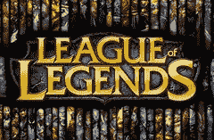

# 英雄联盟如何将聊天扩大到 7000 万玩家-需要很多小兵。

> 原文： [http://highscalability.com/blog/2014/10/13/how-league-of-legends-scaled-chat-to-70-million-players-it-t.html](http://highscalability.com/blog/2014/10/13/how-league-of-legends-scaled-chat-to-70-million-players-it-t.html)

您将如何构建一个聊天服务，每天需要处理 750 万并发玩家，2,700 万每日玩家，每秒 11,000 条消息和每台服务器 10 亿个事件？

什么会产生这么多的流量？ 当然是游戏。 [英雄联盟](http://leagueoflegends.com) 。 英雄联盟是一款基于团队的游戏，一种多人在线战斗竞技场（ [MOBA](http://en.wikipedia.org/wiki/Multiplayer_online_battle_arena) ），其中两支五人的队伍互相对抗，以控制地图和 实现目标。

对于团队而言，成功的沟通至关重要。 我从 [Michal Ptaszek](https://twitter.com/michalptaszek) 中了解到，在关于 [扩展英雄联盟的有趣演讲中，与 7,000 万玩家聊天](https://www.youtube.com/watch?v=_jsMpmWaq7I) （ [幻灯片](http://www.slideshare.net/michalptaszek/strange-loop-presentation) ）在 [Strange Loop 2014](https://thestrangeloop.com/) 会议。 Michal 很好地说明了为什么多人团队游戏需要玩家之间的良好沟通。 想象一下没有打篮球的篮球比赛。 这是行不通的。 因此，这意味着聊天至关重要。 聊天不是“很好”的功能。

Michal 以一种有趣的方式构建了对话，将以下表达用作模板：使之起作用。 改正它。 快一点。

使其工作意味着从 XMPP 开始作为聊天的基础。 WhatsApp 遵循 [相同的策略](http://highscalability.com/blog/2014/2/26/the-whatsapp-architecture-facebook-bought-for-19-billion.html) 。 开箱即用，您将获得可以正常使用和扩展的功能……直到用户数真正增加。 为了使其正确而快速，例如 WhatsApp，《英雄联盟》发现自己自定义了 Erlang VM。 添加许多监视功能和性能优化，以消除破坏大规模性能的瓶颈。

他们聊天架构中最有趣的部分可能是使用 Riak 的 [CRDT](http://blog.joeljacobson.com/riak-2-0-data-types/) （会聚复制数据类型）来实现 他们没有共享的目标助长了大规模线性水平可伸缩性。 CRDT 仍然很深奥，因此您可能还没有听说过它们，但是如果您可以让它们为您服务，那么它们将是下一件很酷的事情。 这是处理写入的另一种思考方式。

让我们了解一下英雄联盟如何构建他们的聊天系统来处理 7000 万玩家...

## 统计信息

*   每月有 6700 万唯一身份玩家（不包括聊天中的其他服务）

*   每天有 2700 万玩家

*   750 万并发玩家

*   仅使用 20％到 30％的可用 CPU 和 RAM，每天每台服务器路由 10 亿个事件。

*   每秒 11K 条消息

*   全世界部署了数百个聊天服务器。 由 3 个人管理。

*   99％的正常运行时间。

## 平台

*   [Ejabberd](https://www.ejabberd.im/) （基于 Erlang）XMPP 服务器

*   修复

*   负载均衡器

*   石墨

*   Zabbix

*   Nagios

*   詹金斯

*   汇合

## 聊天

*   可以是一对一或群聊。

*   聊天充当在线状态服务，并且还维护好友列表。 它知道播放器是在线还是离线。 他们在玩吗？ 他们玩了多久了？ 他们在玩什么冠军？

*   REST API 提供聊天作为其他 LoL 服务的后端服务。 例如，商店通过聊天来验证友谊。 联赛使用聊天社交图谱将新玩家分组在一起，以便他们可以更频繁地比赛并相互竞争。

*   聊天必须以低且稳定的延迟运行。 如果聊天不起作用，游戏体验会下降。

*   选择 [XMPP](http://xmpp.org/) 作为协议。 提供消息传递，状态信息，并维护联系人列表。

*   由于性能原因和实施新功能，它们必须与核心 XMPP 协议有所不同。

*   选择 Ejabberd 作为他们的服务器。 一开始它运作良好。 Erlang 有很多好处。 它的构建考虑了并发性，分发性和可伸缩性。 它支持热代码重载，因此可以在不停止服务的情况下修补错误。

*   目标是 [不共享任何体系结构](http://en.wikipedia.org/wiki/Shared_nothing_architecture) 以实现大规模线性水平可伸缩性。 还可以实现更好的错误隔离和可追溯性。 尚不存在，但正在朝着这个目标取得进展。

*   拥有数百个聊天服务器，只有几个人可以管理它们，因此服务器必须具有容错能力，这一点很重要。 并非每一次失败都需要人工干预。

*   让它崩溃。 不要试图从重大故障中缓慢恢复。 而是从已知状态重新启动。 例如，如果有大量待处理查询积压到数据库中，则数据库将重新启动。 所有新查询都会实时处理，而排队的查询将重新安排进行处理。

*   每个物理服务器都运行 Ejabberd 和 Riak。 Riak 用作数据库。 可以根据需要水平添加服务器。 Ejabberd 在集群中运行。 风险服务器也运行在它们自己的群集中。

*   Riak 服务器使用多数据中心复制将持久性数据导出到辅助 Riak 群集。 像社交图查询一样，昂贵的 ETL 查询在辅助群集上运行，而不会中断主要群集。 备份也会在辅助群集上运行。

*   随着时间的流逝，由于必须关注可伸缩性，性能和容错能力，因此大部分 Ejabberd 都被重写。

    *   重写以符合他们的要求。 例如，在 LoL 友谊仅是双向的，XMPP 允许非对称友谊。 XMPP 友谊的创建需要客户端和服务器之间大约有 16 条消息，这对数据库造成了打击。 新协议是三个消息。

    *   删除了不必要的代码。

    *   优化了协议本身。

    *   写了很多测试以确保没有损坏。

*   配置文件代码可消除明显的瓶颈。

*   避免共享可变状态，因此它可以在单个服务器上以及在集群环境中线性扩展。

    *   多用户聊天（MUC）。 每个聊天服务器都可以处理数十万个连接。 对于每个用户连接，都有一个会话过程。 每次用户想要更新其状态或向房间发送消息时，事件都必须转到称为 MUC 路由器的单个进程中。 然后它将消息中继到相关的群聊。 这是一个明显的瓶颈。 解决方案是并行化路由。 现在，在用户会话中查找群组聊天室。 能够使用所有可用的内核。

    *   每个 Ejabberd 服务器都包含会话表的副本，该表包含用户 ID 和会话之间的映射。 发送消息需要查看用户会话在集群中的位置。 消息已写入会话表。 通过检查会话是否存在，检查存在优先级以及其他一些检查，分布式写操作的数量减少了 96％。 巨大的胜利。 更多的用户可以更快地登录，并且状态更新可以更频繁地发生。

*   新增的功能使您可以更好地了解已升级到生产中的代码。 因此，可以在事务上下文中一次在多个服务器上更新代码。

*   为了优化服务器，调试功能已添加到 Erlang VM 中。 需要具有查看会话中内存使用情况的能力，以便他们可以更好地优化内存使用率。

*   从一开始就设计了数据库可伸缩性。 从 MySQL 开始，但是遇到了多个性能，可靠性和可伸缩性问题。 例如，不可能足够快地更新架构以跟踪代码中所做的更改。

    *   因此，他们选择了 Riak。 Riak 是分布式，容错的键值存储。 真正的无主，所以没有单点故障。 即使两台服务器故障也不会降低服务质量或丢失数据。

    *   必须在聊天服务器上花费大量工作来实现最终的一致性。 实现了 Ejabberd [CRDT 库](http://blog.joeljacobson.com/riak-2-0-data-types/) （会聚复制数据类型）。 负责所有写冲突。 尝试将对象收敛到稳定状态。

    *   CRDT 如何工作？ 与其将新玩家直接添加到好友列表中，不如保留对象的操作日志。 日志中有“添加播放器 1”和“添加播放器 2”之类的条目。 下次读取该对象时，将查阅该日志并解决所有冲突。 然后将日志以任何顺序应用于对象，因为顺序无关紧要。 这样，朋友列表就处于一致状态。 想法是在适当的位置更新值，而不是为对象建立一长串的操作日志，并且只要读取对象就应用该操作。

    *   Riak 取得了巨大的成功。 允许线性缩放。 还提供了方案灵活性，因为可以随时更改对象。

    *   这是一个巨大的思想转变和大量的工作。 它改变了他们测试服务并围绕它构建工具的方式。

## 监控

*   内置了超过 500 个实时计数器，每分钟收集一次并发布到监视系统（Graphite，Zabbix，Nagios）中。

*   计数器具有阈值，在超过阈值时会生成警报。 在玩家注意到任何服务问题之前就可以解决问题。

*   例如，最近的客户端更新进入了广播自己存在状态的无限循环。 观察 Graphite，立即可以看出聊天服务器受到了从新客户端版本开始的状态更新的冲击。

## 实现功能切换（功能标志）

*   能够即时打开和关闭新功能，而无需重新启动服务。

*   开发新功能时，将通过开/关开关将其包围。 如果某个功能导致问题，则可以将其禁用。

*   部分部署。 只能为某些用户启用新代码，或者一定比例的用户可以激活新代码。 这样可以在远低于满载的情况下测试潜在危险功能。 如果新功能有效，则可以为所有人打开。

## 快速重新加载代码

*   Erlang 的一大特色是能够即时热加载新代码。

*   在一种情况下，第三方客户（如 pidgin）没有经过良好的测试，结果证明他们发送的事件与官方客户不同。 可以将这些修补程序部署并集成到聊天服务器中，而不必重新启动整个聊天。 这意味着减少了玩家的停机时间。

## 正在记录

*   记录所有异常情况，例如错误和警告。

*   服务器还报告运行状况良好，从而可以查看日志并确定服务器是否正常，因为它正在记录用户，接受新连接，修改好友列表。

*   内置进入所选用户会话的调试模式的功能。 如果有可疑用户或实验用户（在生产服务器上进行质量检查），即使聊天服务器上有 100,000 个会话，也只需记录特定的会话即可。 日志记录包括 XML 流量，事件和指标。 这样可以节省大量的日志存储空间。

*   通过功能切换，部分部署和选择性日志记录的组合，可以将功能部署到生产服务器，因此只能由几个人进行测试。 可以收集和分析相关日志，而不会受到所有用户的干扰。

## 负载测试代码

*   每天晚上，自动验证系统都会将所有更改的构建部署到负载测试环境，并运行一系列负载测试。

*   在测试过程中监视服务器的运行状况。 指标被提取和分析。 将生成一个 Confluence 页面，其中包含所有指标和测试结果。 将发送电子邮件摘要以及测试结果摘要。

*   可以将更改与以前的版本进行比较，因此可以跟踪代码更改对测试的影响，发现灾难或诸如内存使用量减少了 X％之类的更改。

## 未来

*   从 MySQL 迁移数据。

*   希望在游戏外提供聊天功能，以便玩家无需登录游戏即可享受友谊。

*   想使用社交图谱来改善体验。 分析玩家之间的联系，并了解其如何影响游戏的乐趣。

*   计划将游戏内聊天迁移到游戏外聊天服务器。

## 获得的经验教训

*   **事情将失败**。 您没有完全的控制权。 即使您的代码没有错误，如果 ISP 的路由器死亡并且同时失去 100,000 个播放器，会发生什么情况？ 做好准备 确保您的系统可以一次处理掉一半的玩家。 或者在 20 个聊天服务器中损失 5 个而不会降低性能。

*   **缩放表面虫** 。 即使一个错误仅发生十亿次，这意味着在英雄联盟的规模下，该错误每天也会发生一次。 随着时间的流逝，甚至不太可能发生的事件。

*   **成功的关键是了解系统实际上在做什么** 。 了解您的系统是否处于健康状态或即将崩溃。

*   **制定策略** 。 大声笑有一种横向扩展其聊天服务的策略。 为了支持他们的策略，他们做了一些不同的事情。 他们不仅使用 Riak 购买了 NoSQL，而且改变了利用 CRDT 的方法，以使水平扩展尽可能无缝和强大。

*   **使它起作用** 。 从某个地方开始发展。 埃贾伯德把他们弄倒了。 从头开始会更容易吗？ 也许可以，但是当他们了解了需求是什么时，他们便能够开发出满足他们需求的系统。

*   **使其可见** 。 添加跟踪，日志记录，警报，监视，图形以及所有这些好东西。

*   **使其成为 DevOps** 。 LoL 在软件更新，功能标记，热更新，自动负载测试，高度可配置的日志级别等中添加了事务，以使系统更易于管理。

*   **减少聊天协议** 。 根据系统需求定制功能。 例如，如果您的系统仅支持双向友谊，那么您就不会采用更为通用和昂贵的协议。

*   **避免共享可变状态** 。 这是一种常见的策略，但是看到共享状态如何在每次扩大规模时引起越来越多的问题总是很有趣的。

*   **利用您的社交图** 。 聊天服务自然会提供社交图。 该信息可用于改善用户体验和实现新颖的新功能。

## 相关文章

*   [在 Reddit 上](http://www.reddit.com/r/programming/comments/2j95dv/how_league_of_legends_scaled_chat_to_70_million/)

*   [使用 Erlang 的新 Facebook 聊天功能可扩展至 7000 万用户](http://highscalability.com/blog/2008/5/14/new-facebook-chat-feature-scales-to-70-million-users-using-e.html) （2008）

*   [HipChat 如何使用 ElasticSearch 和 Redis 存储和索引数十亿条消息](http://highscalability.com/blog/2014/1/6/how-hipchat-stores-and-indexes-billions-of-messages-using-el.html) （使用 XMPP）

*   [Facebook 以 190 亿美元的价格收购了 WhatsApp 架构](http://highscalability.com/blog/2014/2/26/the-whatsapp-architecture-facebook-bought-for-19-billion.html) （使用 XMPP）

*   [误区：埃里克·布鲁尔（Eric Brewer）论为何银行不使用碱-可用性是收入](http://highscalability.com/blog/2013/5/1/myth-eric-brewer-on-why-banks-are-base-not-acid-availability.html)

*   [英雄联盟内部，电子竞技的主要赛事](http://www.nytimes.com/2014/10/12/technology/riot-games-league-of-legends-main-attraction-esports.html)

很棒的文章，谢谢！ 一个小小的更正：Riak（还有问题）中的 CRDT 风格是收敛的复制数据类型，而不是您的文章所说的可交换的

从某种意义上讲，CRDT 并不是新事物：您的银行分类帐是事件日志，并且在存在所有此类即时网络之前，银行分支机构通常会在一天结束时合并其日志，以获取权威的银行余额。 但是显然，分布式数据库专家并没有永远谈论 CRDT，所以我知道您的意思。

很酷的文章！ 作为每天使用 Erlang 的人，看到越来越多的知名项目/公司使用它总是很有趣。 感觉就像总是隐藏在 XD 中的那些语言之一

想一想游戏的持续发展速度如何，而且除了 DDOS 攻击之外，几乎没有打 h 过，这真是令人惊讶。